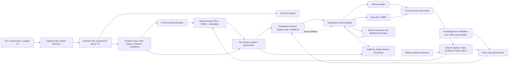

# KarsaHire — Rencana Arsitektur AI Recruitment Copilot

**Tujuan:** merancang copilot rekrutmen perusahaan yang membantu tim menyusun kriteria, memproses CV, mencari bukti kecocokan, dan mengoordinasikan review kandidat. Sistem memberi rekomendasi beserta bukti; recruiter dan hiring manager tetap membuat keputusan seleksi.

**Asumsi ruang lingkup:** “fokus ke case cooperation” saya artikan sebagai penggunaan korporat dengan kerja bersama recruiter, hiring manager, HRBP, dan bila perlu tim privasi/DEI. Jika maksudnya sektor atau studi kasus tertentu, nama sektor dapat diganti tanpa mengubah pola arsitektur inti.

**Status:** MVP lokal awal sudah dibuat, termasuk OCR opsional untuk PNG/JPG dan halaman scan PDF melalui API internal dengan key dari environment. Lihat [README](README.md) untuk menjalankan dan batasan implementasi; matching masih leksikal dan Q&A retrieval-only, sementara embedding/RAG generatif masih tahap berikutnya.

## 1. Sasaran produk dan batas keputusan

- Mengurangi waktu administrasi untuk membaca CV dan menyiapkan shortlist.
- Menyamakan pemahaman tentang persyaratan wajib, kompetensi, dan rubrik antaranggota tim.
- Menampilkan kutipan CV dan sumber data di balik setiap sinyal kecocokan.
- Mencatat reviewer, versi kriteria, rekomendasi, perubahan skor, alasan override, dan keputusan akhir.
- Tidak menyaring atau menolak pelamar secara otomatis. Skor adalah alat bantu triase, bukan prediksi nilai seseorang atau keputusan perekrutan.

## 2. Arsitektur tingkat tinggi



### Komponen dan batas data

1. **Ingestion:** menerima CV dari ATS atau portal yang berwenang; validasi file, virus scan, bahasa, format, dan duplikasi. Simpan dokumen asli secara terenkripsi dengan retensi yang mengikuti kebijakan perusahaan.
2. **Parsing:** ekstrak teks PDF/DOCX; gunakan layout/OCR untuk dokumen hasil scan. Parser menghasilkan JSON sesuai schema berversi dan menyimpan kutipan asli, nomor halaman/bounding box, serta confidence tiap field. Field confidence rendah masuk antrean koreksi manual.
3. **Identitas dan PII:** nama, email, nomor telepon, alamat, foto, tanggal lahir, serta atribut sensitif berada di penyimpanan terpisah dari profil yang dipakai untuk pencocokan. Jangan menebak atribut sensitif dari nama, foto, atau teks. Bila perusahaan mengumpulkan data demografis untuk audit kesetaraan, pisahkan akses dan tujuan pemrosesannya dari ranking.
4. **Job intake dan criterion registry:** job description disusun bersama recruiter dan hiring manager. Tandai setiap butir sebagai wajib atau preferensi, definisikan level bukti yang dapat diterima, dan setujui bobot sebelum melihat ranking kandidat. Simpan versi dan persetujuannya.
5. **Retrieval:** metadata/filter deterministik untuk syarat yang eksplisit, BM25 untuk istilah yang persis, dan embedding untuk variasi istilah/skill. Batasi pencarian berdasarkan organisasi, requisition, dan izin reviewer sebelum vector search dilakukan.
6. **Pencocokan dan ranking:** periksa tiap kriteria secara terpisah memakai skill/occupation taxonomy dan reranker. Skor agregat boleh dipakai untuk mengurutkan kandidat yang perlu ditinjau; skor harus menampilkan confidence dan bukti. Data hasil hire historis tidak dijadikan label utama tanpa validasi karena dapat mengulang pola seleksi masa lalu.
7. **RAG internal:** gunakan dokumen perusahaan yang disetujui—rubrik kompetensi, job level, aturan proses, FAQ, serta job requirement versi aktif. RAG menjawab “kriteria apa yang disetujui?” atau “rubrik apa yang dipakai?”, bukan membuat aturan baru. CV diperlakukan sebagai data tidak tepercaya; instruksi di dalam CV tidak boleh menjalankan tool atau mengubah kriteria.
8. **Audit dan observability:** catat event, bukan salinan CV yang berlebihan: identitas pseudonim kandidat, job/requisition, versi parser/model/kriteria, evidence IDs, skor per kriteria, reviewer, timestamp, override, serta alasan. Terapkan enkripsi, RBAC/ABAC, batas tenant, retensi, penghapusan, dan jejak akses.

## 3. Strategi ranking dan explainability

### Skor sebagai ringkasan evidence

Untuk kriteria yang telah disetujui, tetapkan nilai pencocokan per kriteria, misalnya `0 = tidak ada bukti`, `1 = bukti parsial`, `2 = bukti kuat`. Agregasi berbobot dapat berupa `sum(weight_i × match_i) / sum(weight_i)`. Tampilkan juga tingkat keyakinan dan jumlah field yang belum diketahui; **data yang tidak tercantum di CV harus tampil sebagai “belum diketahui”, bukan otomatis “tidak memenuhi”**.

Hard gate hanya boleh dipakai untuk persyaratan objektif, relevan dengan pekerjaan, dan sudah ditinjau manusia. Bila informasi CV tidak cukup untuk memeriksa syarat, tandai “perlu verifikasi”. Jangan membuat ambang skor yang otomatis menolak kandidat.

### Kartu penjelasan yang ditampilkan

- Kriteria dan bobot yang telah disetujui untuk requisition ini.
- Status per kriteria: cocok, sebagian, belum ada bukti, atau perlu verifikasi.
- Kutipan CV/job application, halaman atau bagian asal, serta tingkat confidence parser.
- Ringkasan gap dan pertanyaan verifikasi yang netral untuk recruiter.
- Pemisahan fakta CV, hasil normalisasi skill, dan inferensi model.
- Riwayat perubahan urutan dan alasan reviewer mengubah rekomendasi.

LLM boleh menulis ringkasan dari evidence terpilih, tetapi tidak menjadi sumber skor dan tidak boleh mengarang alasan. UI harus memungkinkan reviewer membuka kutipan sumber. Jangan menghasilkan label kepribadian, “culture fit”, atau kemampuan kerja sama dari gaya bahasa. Untuk menilai kolaborasi, gunakan evidence perilaku terkait pekerjaan yang terstruktur dan pertanyaan wawancara yang sama untuk semua kandidat.

## 4. Alur kerja kolaboratif perusahaan

| Tahap | Recruiter / HRBP | Hiring manager | Sistem / governance |
|---|---|---|---|
| Buka requisition | Menyusun intake dan mengelola proses | Menjelaskan hasil kerja, skill wajib, dan level | Merekam kriteria, bobot, sumber, dan versi |
| Setujui kriteria | Memeriksa konsistensi dan kelayakan proses | Menyetujui kompetensi serta contoh evidence | Mencegah perubahan diam-diam setelah ranking |
| Terima kandidat | Memeriksa parsing yang confidence-nya rendah | — | Memisahkan PII, membuat profil dan evidence ledger |
| Review shortlist | Mengelola antrean dan status kandidat | Menilai evidence yang relevan dengan pekerjaan | Menampilkan alasan per kriteria; menyediakan blind-first review bila sesuai |
| Wawancara | Menjadwalkan dan menjaga proses konsisten | Mengisi rubrik yang sama dan memberi evidence | Menyimpan feedback terstruktur; komentar bebas bukan label training otomatis |
| Keputusan | Mengkoordinasikan debrief dan komunikasi | Memberi rekomendasi manusia | Merekam keputusan akhir, reviewer, override, dan audit |

Status workflow yang disarankan: `Draft requisition → Criteria approved → Applications received → Parsing review → Recruiter review → Hiring-manager review → Interview → Debrief → Human decision → Closed`. Setiap perubahan kriteria setelah aplikasi masuk perlu alasan dan approval; evaluasi model sebelum/sesudah perubahan dipisahkan.

## 5. Sumber dataset dan repositori Hugging Face

Repositori Hugging Face berikut adalah **dataset untuk diunduh**, bukan izin otomatis untuk melakukan scraping atau menggunakannya dalam keputusan hiring. Mulai dari sintetis untuk pengembangan; sebelum data nyata dipakai, tinjau asal-usul, lisensi dataset asal, izin penggunaan, kandungan PII, dan kebutuhan lokal.

| Repositori | Kegunaan yang sesuai | Catatan kualitas / lisensi |
|---|---|---|
| [sukhrobnurali/resume-parsing-vision](https://huggingface.co/datasets/sukhrobnurali/resume-parsing-vision) | Uji parsing CV multi-layout: 1.000 CV sintetis berupa gambar dan JSON ground truth 23 field. Cocok untuk smoke test OCR/layout dan ekstraksi schema. | Dataset card menyebut CC BY 4.0 dan tidak ada data pribadi nyata. Bahasa Inggris dan peran IT; tidak mewakili semua CV atau pasar Indonesia. |
| [JobSelect/Job-Descriptions-JobAnalyze_6k](https://huggingface.co/datasets/JobSelect/Job-Descriptions-JobAnalyze_6k) | Contoh job intake/JD: deskripsi, kualifikasi, pengalaman, skill teknis dan soft skills. Cocok untuk uji ekstraksi kriteria. | Dataset card menampilkan 609 baris dan lisensi MIT. Kecil; jangan perlakukan sebagai lowongan aktif atau label performa. |
| [med2425/resume-job-fit-merged-v1](https://huggingface.co/datasets/med2425/resume-job-fit-merged-v1) | Uji pipeline pasangan resume–JD dan ranking prototipe; tersedia 93.733 pasangan dengan label Good Fit/Potential Fit/No Fit serta field `source`. | Card menjelaskan campuran dataset publik dan pasangan sintetis; label dibuat Qwen2.5-32B, termasuk test sintetis. Gunakan hanya sebagai smoke test/baseline, bukan ground truth kualitas kandidat. Pastikan lisensi dan hak dari sumber asal sebelum penggunaan ulang. |
| [danieldux/ESCO](https://huggingface.co/datasets/danieldux/ESCO) | Seed taxonomy untuk normalisasi occupation/skill; membantu menyatukan variasi nama skill. | Repo menampilkan lisensi `cc`; periksa file lisensi, versi, bahasa, dan syarat atribusi sebelum distribusi atau penggunaan komersial. |
| [yashpwr/resume-ner-bert-v2](https://huggingface.co/yashpwr/resume-ner-bert-v2) *(model, bukan dataset)* | Baseline pembanding ekstraksi entity untuk CV teks berbahasa Inggris. | Repo menyatakan Apache-2.0 dan melaporkan F1 90,87%; angka klaim model-card perlu direproduksi pada data berizin milik perusahaan. Card menyebut keterbatasan bahasa Inggris, dokumen teks, dan panjang hingga 512 token. |

**Urutan data yang disarankan:** (1) CV/JD sintetis untuk demo, (2) sampel CV yang dibuat atau diberikan dengan izin eksplisit dan dianonimkan untuk validasi lokal, (3) data aplikasi ATS perusahaan hanya setelah tinjauan privasi/keamanan dan dasar pemrosesan disetujui. Jangan memasukkan CV nyata perusahaan ke dataset publik atau upload ke Hub.

### Mengunduh dataset prototipe

```python
from datasets import load_dataset

resume_parser_data = load_dataset("sukhrobnurali/resume-parsing-vision")
job_intake_data = load_dataset("JobSelect/Job-Descriptions-JobAnalyze_6k")
resume_job_fit_data = load_dataset("med2425/resume-job-fit-merged-v1")
esco_taxonomy = load_dataset("danieldux/ESCO")
```

Untuk eksperimen berulang, pin setiap dataset ke commit/revision tertentu, catat hash file, versi library, lisensi dan versi dataset, serta jangan menggabungkan pasangan resume/JD dari sumber berbeda sebelum memeriksa kebocoran train/test. Pada pasangan synthetic-labeled, jangan melatih sistem seolah label model lain adalah putusan recruiter.

### Strategi akuisisi data operasional

- Gunakan API/ekspor ATS dan CV yang dilamar langsung oleh kandidat, dengan tujuan penggunaan yang disampaikan secara jelas.
- Untuk JD eksternal, pilih feed/API resmi atau sumber yang mengizinkan crawling. Simpan URL sumber, waktu pengambilan, versi, dan dasar hak pakai; hormati terms/robots dan batas akses. Hindari scraping profil kandidat atau job boards yang melarangnya.
- Simpan data mentah seminimal mungkin, pseudonimkan ID, buat masa retensi/penghapusan, dan sediakan proses koreksi parsing.
- Untuk anotasi, minta dua reviewer (recruiter + hiring manager) menilai kecocokan per kriteria dengan rubrik yang sama; adjudikasi disagreement. Jangan menganggap hired/rejected historis sebagai label objektif tanpa audit.

## 6. Rencana implementasi

| Fase | Deliverable | Exit criteria |
|---|---|---|
| 0. Discovery dan tata kelola | Use case satu rumpun jabatan, peta ATS/data, role akses, kebijakan retensi, schema kandidat/job, daftar kriteria yang dilarang | HR, hiring manager, security/privacy menyetujui tujuan, data source, peran, dan kriteria pekerjaan |
| 1. Parser dan evidence ledger | Ingestion PDF/DOCX, OCR, JSON berversi, confidence, kutipan halaman, antrean koreksi | Evaluasi field-level precision/recall/F1 dan error per format/bahasa; target disepakati pada sampel berizin |
| 2. Intake, taxonomy, dan RAG | Form job intake; criterion registry; retrieval ke rubrik dan kebijakan aktif dengan citation | Jawaban internal menyertakan sumber/versi; tidak mencampur data antar-job atau antar-tenant |
| 3. Retrieval dan shortlist assist | Baseline BM25 + embedding; reranker; skor per kriteria; kartu bukti | Evaluasi Recall@K dan nDCG@K memakai penilaian recruiter/hiring manager yang teradjudikasi; review manusia wajib |
| 4. Workspace kolaboratif | Role-based review, komentar berbasis evidence, status, rubrik wawancara, override dan audit trail | Uji alur end-to-end satu requisition; agreement/disagreement reviewer terlihat dan tercatat |
| 5. Shadow pilot | Jalankan tanpa mengubah keputusan atau mengirim komunikasi otomatis ke kandidat | Audit performa, parsing, fairness, akses, keamanan, dan dampak beban reviewer lulus kriteria yang telah ditetapkan |
| 6. Pilot terbatas | Satu rumpun jabatan, cohort kecil, pemantauan mingguan dan tombol pause | Persetujuan governance dan perbaikan berdasarkan bukti; perluasan bertahap hanya bila exit criteria terpenuhi |

Jangan menentukan ambang performa dari angka dataset sintetis. Tetapkan target dengan tim rekrutmen setelah baseline manual dan anotasi berizin tersedia.

## 7. Evaluasi dan kontrol

- **Parsing:** precision/recall/F1 per field, exact match untuk tanggal/degree/skill, akurasi posisi kutipan, confidence calibration; breakdown per layout, bahasa, dan jenis file.
- **Ranking:** Recall@K, nDCG@K, MAP, tingkat kandidat layak yang muncul pada top-K; gunakan penilaian ahli yang disepakati dan split berdasarkan kandidat serta requisition agar tidak bocor.
- **Evidence/explainability:** persentase klaim yang ditopang kutipan, keterlacakan ke halaman, tingkat ringkasan tanpa dukungan, dan waktu reviewer menemukan bukti.
- **Kolaborasi:** kesepakatan recruiter–hiring manager, jumlah override beserta alasannya, perubahan kriteria, waktu review, dan konsistensi rubrik wawancara.
- **Fairness:** audit pada tiap tahap (sourcing bila ada → aplikasi → shortlist → wawancara), bukan hanya hasil shortlist. Bandingkan selection rate dan error/recall antarkelompok bila data demografis sukarela tersedia dan boleh dipakai untuk tujuan audit; laporkan ukuran sampel/ketidakpastian dan intersectional breakdown. Uji counterfactual perubahan sinyal identitas yang tidak relevan untuk melihat perubahan ranking.
- **Keamanan:** hak akses per tenant/job; audit ekspor/penghapusan; cek prompt injection di dokumen; uji kebocoran silang; retensi dan incident response.

Metrik kesetaraan tidak boleh dijadikan satu angka “adil” tanpa meninjau perbedaan base rate, tahap proses, kualitas anotasi, dan dampak bagi kandidat. Tinjau hasil bersama pemilik proses bisnis, privasi, security, dan perwakilan kandidat bila memungkinkan.

## 8. Referensi paper dan jurnal

1. Lewis et al. (2020), [Retrieval-Augmented Generation for Knowledge-Intensive NLP Tasks — NeurIPS](https://papers.nips.cc/paper/2020/hash/6b493230205f780e1bc26945df7481e5-Abstract.html). Fondasi RAG dengan retrieved evidence/provenance; mendukung jawaban internal yang bisa ditelusuri ke dokumen.
2. Bhatia et al. (2019), [End-to-End Resume Parsing and Finding Candidates for a Job Description using BERT](https://arxiv.org/abs/1910.03089). Pipeline parser CV lalu matching kandidat–JD; berguna sebagai baseline arsitektur dua tahap.
3. Lavi, Medentsiy & Graus (2021), [conSultantBERT: Fine-tuned Siamese Sentence-BERT for Matching Jobs and Job Seekers — RecSys HR Workshop](https://arxiv.org/abs/2109.06501). Kasus industri Randstad dengan lebih dari 270 ribu pasangan berlabel oleh konsultan staffing; langsung relevan dengan alur enterprise dan masukan pakar.
4. Yu, Zhang & Yu (2024), [ConFit: Improving Resume-Job Matching using Data Augmentation and Contrastive Learning](https://arxiv.org/abs/2401.16349). Menguji matching/ranking dengan data interaksi jarang. Paper juga menemukan sebagian error berakar pada informasi CV/JD yang tidak cukup atau faktor di luar dokumen; alasan kuat untuk memisahkan “tidak ada bukti” dari “tidak cocok”.
5. Fabris et al. (2025), [Fairness and Bias in Algorithmic Hiring: A Multidisciplinary Survey — ACM TIST](https://doi.org/10.1145/3696457). Tinjauan lintas disiplin tentang audit fairness dalam hiring; menyoroti evaluasi pada konteks stakeholder/workflow organisasi.
6. Alexander et al. (2025), [Sourcing algorithms: Rethinking fairness in hiring in the era of algorithmic recruitment — International Journal of Selection and Assessment](https://doi.org/10.1111/ijsa.12499). Menunjukkan audit perlu memperhatikan sourcing awal, sebab bias sebelum seseorang melamar tidak terlihat jika metrik hanya dihitung pada pelamar.
7. Webster (2025), [Fairness Is Not Enough: Auditing Competence and Intersectional Bias in AI-powered Resume Screening — preprint](https://arxiv.org/abs/2507.11548). Audit awal yang mengingatkan bahwa sistem harus diuji atas kompetensi evaluasi selain parity; perlakukan sebagai preprint, bukan konsensus jurnal.

## 9. Keputusan yang dibutuhkan sebelum implementasi

- ATS dan satu rumpun jabatan untuk pilot pertama.
- Bahasa CV yang wajib didukung (Indonesia, Inggris, atau keduanya).
- Apakah ranking hanya untuk pencarian recruiter atau juga untuk shortlist bersama hiring manager.
- Daftar sumber dokumen perusahaan yang boleh masuk knowledge base RAG.
- Pemilik approval kriteria, akses audit fairness, retensi, dan koreksi data.

**Rekomendasi awal:** bangun parser + evidence ledger dan workspace job intake lebih dahulu; mulai matching dengan BM25/embedding transparan dalam shadow mode. Tambahkan reranker dan RAG setelah kriteria serta korpus internal disetujui. Perluas hanya setelah evaluasi lokal membuktikan kualitas dan fairness yang cukup.
