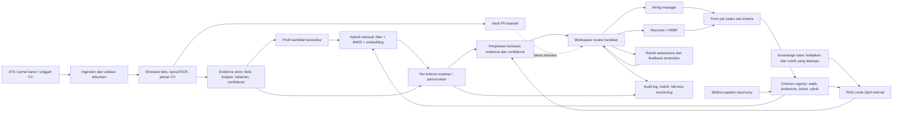

# KarsaHire — Rencana Arsitektur AI Recruitment Copilot

**Tujuan:** merancang copilot rekrutmen perusahaan yang membantu tim menyusun kriteria, memproses CV, mencari bukti kecocokan, dan mengoordinasikan review kandidat. Sistem memberi rekomendasi beserta bukti; recruiter dan hiring manager tetap membuat keputusan seleksi.

**Asumsi ruang lingkup:** “fokus ke case cooperation” saya artikan sebagai penggunaan korporat dengan kerja bersama recruiter, hiring manager, HRBP, dan bila perlu tim privasi/DEI. Jika maksudnya sektor atau studi kasus tertentu, nama sektor dapat diganti tanpa mengubah pola arsitektur inti.

**Status:** MVP lokal awal sudah dibuat, termasuk OCR opsional untuk PNG/JPG dan halaman scan PDF melalui API internal dengan key dari environment. Lihat [README](README.md) untuk menjalankan dan batasan implementasi; matching masih leksikal dan Q&A retrieval-only, sementara embedding/RAG generatif masih tahap berikutnya.

## 1. Sasaran produk dan batas keputusan

- Mengurangi waktu administrasi untuk membaca CV dan menyiapkan shortlist.
- Menyamakan pemahaman tentang persyaratan wajib, kompetensi, dan rubrik antaranggota tim.
- Menampilkan kutipan CV dan sumber data di balik setiap sinyal kecocokan.
- Mencatat reviewer, versi kriteria, rekomendasi, perubahan skor, alasan override, dan keputusan akhir.
- Tidak menyaring atau menolak pelamar secara otomatis. Skor adalah alat bantu triase, bukan prediksi nilai seseorang atau keputusan perekrutan.

## 2. Arsitektur tingkat tinggi



### Komponen dan batas data

1. **Ingestion:** menerima CV dari ATS atau portal yang berwenang; validasi file, virus scan, bahasa, format, dan duplikasi. Simpan dokumen asli secara terenkripsi dengan retensi yang mengikuti kebijakan perusahaan.
2. **Parsing:** ekstrak teks PDF/DOCX; gunakan layout/OCR untuk dokumen hasil scan. Parser menghasilkan JSON sesuai schema berversi dan menyimpan kutipan asli, nomor halaman/bounding box, serta confidence tiap field. Field confidence rendah masuk antrean koreksi manual.
3. **Identitas dan PII:** nama, email, nomor telepon, alamat, foto, tanggal lahir, serta atribut sensitif berada di penyimpanan terpisah dari profil yang dipakai untuk pencocokan. Jangan menebak atribut sensitif dari nama, foto, atau teks. Bila perusahaan mengumpulkan data demografis untuk audit kesetaraan, pisahkan akses dan tujuan pemrosesannya dari ranking.
4. **Job intake dan criterion registry:** job description disusun bersama recruiter dan hiring manager. Tandai setiap butir sebagai wajib atau preferensi, definisikan level bukti yang dapat diterima, dan setujui bobot sebelum melihat ranking kandidat. Simpan versi dan persetujuannya.
5. **Retrieval:** metadata/filter deterministik untuk syarat yang eksplisit, BM25 untuk istilah yang persis, dan embedding untuk variasi istilah/skill. Batasi pencarian berdasarkan organisasi, requisition, dan izin reviewer sebelum vector search dilakukan.
6. **Pencocokan dan ranking:** periksa tiap kriteria secara terpisah memakai skill/occupation taxonomy dan reranker. Skor agregat boleh dipakai untuk mengurutkan kandidat yang perlu ditinjau; skor harus menampilkan confidence dan bukti. Data hasil hire historis tidak dijadikan label utama tanpa validasi karena dapat mengulang pola seleksi masa lalu.
7. **RAG internal:** gunakan dokumen perusahaan yang disetujui—rubrik kompetensi, job level, aturan proses, FAQ, serta job requirement versi aktif. RAG menjawab “kriteria apa yang disetujui?” atau “rubrik apa yang dipakai?”, bukan membuat aturan baru. CV diperlakukan sebagai data tidak tepercaya; instruksi di dalam CV tidak boleh menjalankan tool atau mengubah kriteria.
8. **Audit dan observability:** catat event, bukan salinan CV yang berlebihan: identitas pseudonim kandidat, job/requisition, versi parser/model/kriteria, evidence IDs, skor per kriteria, reviewer, timestamp, override, serta alasan. Terapkan enkripsi, RBAC/ABAC, batas tenant, retensi, penghapusan, dan jejak akses.

## 3. Strategi ranking dan explainability

### Skor sebagai ringkasan evidence

Untuk kriteria yang telah disetujui, tetapkan nilai pencocokan per kriteria, misalnya `0 = tidak ada bukti`, `1 = bukti parsial`, `2 = bukti kuat`. Agregasi berbobot dapat berupa `sum(weight_i × match_i) / sum(weight_i)`. Tampilkan juga tingkat keyakinan dan jumlah field yang belum diketahui; **data yang tidak tercantum di CV harus tampil sebagai “belum diketahui”, bukan otomatis “tidak memenuhi”**.

Hard gate hanya boleh dipakai untuk persyaratan objektif, relevan dengan pekerjaan, dan sudah ditinjau manusia. Bila informasi CV tidak cukup untuk memeriksa syarat, tandai “perlu verifikasi”. Jangan membuat ambang skor yang otomatis menolak kandidat.

### Kartu penjelasan yang ditampilkan

- Kriteria dan bobot yang telah disetujui untuk requisition ini.
- Status per kriteria: cocok, sebagian, belum ada bukti, atau perlu verifikasi.
- Kutipan CV/job application, halaman atau bagian asal, serta tingkat confidence parser.
- Ringkasan gap dan pertanyaan verifikasi yang netral untuk recruiter.
- Pemisahan fakta CV, hasil normalisasi skill, dan inferensi model.
- Riwayat perubahan urutan dan alasan reviewer mengubah rekomendasi.

LLM boleh menulis ringkasan dari evidence terpilih, tetapi tidak menjadi sumber skor dan tidak boleh mengarang alasan. UI harus memungkinkan reviewer membuka kutipan sumber. Jangan menghasilkan label kepribadian, “culture fit”, atau kemampuan kerja sama dari gaya bahasa. Untuk menilai kolaborasi, gunakan evidence perilaku terkait pekerjaan yang terstruktur dan pertanyaan wawancara yang sama untuk semua kandidat.

## 4. Alur kerja kolaboratif perusahaan

| Tahap | Recruiter / HRBP | Hiring manager | Sistem / governance |
|---|---|---|---|
| Buka requisition | Menyusun intake dan mengelola proses | Menjelaskan hasil kerja, skill wajib, dan level | Merekam kriteria, bobot, sumber, dan versi |
| Setujui kriteria | Memeriksa konsistensi dan kelayakan proses | Menyetujui kompetensi serta contoh evidence | Mencegah perubahan diam-diam setelah ranking |
| Terima kandidat | Memeriksa parsing yang confidence-nya rendah | — | Memisahkan PII, membuat profil dan evidence ledger |
| Review shortlist | Mengelola antrean dan status kandidat | Menilai evidence yang relevan dengan pekerjaan | Menampilkan alasan per kriteria; menyediakan blind-first review bila sesuai |
| Wawancara | Menjadwalkan dan menjaga proses konsisten | Mengisi rubrik yang sama dan memberi evidence | Menyimpan feedback terstruktur; komentar bebas bukan label training otomatis |
| Keputusan | Mengkoordinasikan debrief dan komunikasi | Memberi rekomendasi manusia | Merekam keputusan akhir, reviewer, override, dan audit |

Status workflow yang disarankan: `Draft requisition → Criteria approved → Applications received → Parsing review → Recruiter review → Hiring-manager review → Interview → Debrief → Human decision → Closed`. Setiap perubahan kriteria setelah aplikasi masuk perlu alasan dan approval; evaluasi model sebelum/sesudah perubahan dipisahkan.

## 5. Sumber dataset dan repositori Hugging Face

Repositori Hugging Face berikut adalah **dataset untuk diunduh**, bukan izin otomatis untuk melakukan scraping atau menggunakannya dalam keputusan hiring. Mulai dari sintetis untuk pengembangan; sebelum data nyata dipakai, tinjau asal-usul, lisensi dataset asal, izin penggunaan, kandungan PII, dan kebutuhan lokal.

| Repositori | Kegunaan yang sesuai | Catatan kualitas / lisensi |
|---|---|---|
| [sukhrobnurali/resume-parsing-vision](https://huggingface.co/datasets/sukhrobnurali/resume-parsing-vision) | Uji parsing CV multi-layout: 1.000 CV sintetis berupa gambar dan JSON ground truth 23 field. Cocok untuk smoke test OCR/layout dan ekstraksi schema. | Dataset card menyebut CC BY 4.0 dan tidak ada data pribadi nyata. Bahasa Inggris dan peran IT; tidak mewakili semua CV atau pasar Indonesia. |
| [JobSelect/Job-Descriptions-JobAnalyze_6k](https://huggingface.co/datasets/JobSelect/Job-Descriptions-JobAnalyze_6k) | Contoh job intake/JD: deskripsi, kualifikasi, pengalaman, skill teknis dan soft skills. Cocok untuk uji ekstraksi kriteria. | Dataset card menampilkan 609 baris dan lisensi MIT. Kecil; jangan perlakukan sebagai lowongan aktif atau label performa. |
| [med2425/resume-job-fit-merged-v1](https://huggingface.co/datasets/med2425/resume-job-fit-merged-v1) | Uji pipeline pasangan resume–JD dan ranking prototipe; tersedia 93.733 pasangan dengan label Good Fit/Potential Fit/No Fit serta field `source`. | Card menjelaskan campuran dataset publik dan pasangan sintetis; label dibuat Qwen2.5-32B, termasuk test sintetis. Gunakan hanya sebagai smoke test/baseline, bukan ground truth kualitas kandidat. Pastikan lisensi dan hak dari sumber asal sebelum penggunaan ulang. |
| [danieldux/ESCO](https://huggingface.co/datasets/danieldux/ESCO) | Seed taxonomy untuk normalisasi occupation/skill; membantu menyatukan variasi nama skill. | Repo menampilkan lisensi `cc`; periksa file lisensi, versi, bahasa, dan syarat atribusi sebelum distribusi atau penggunaan komersial. |
| [yashpwr/resume-ner-bert-v2](https://huggingface.co/yashpwr/resume-ner-bert-v2) *(model, bukan dataset)* | Baseline pembanding ekstraksi entity untuk CV teks berbahasa Inggris. | Repo menyatakan Apache-2.0 dan melaporkan F1 90,87%; angka klaim model-card perlu direproduksi pada data berizin milik perusahaan. Card menyebut keterbatasan bahasa Inggris, dokumen teks, dan panjang hingga 512 token. |

**Urutan data yang disarankan:** (1) CV/JD sintetis untuk demo, (2) sampel CV yang dibuat atau diberikan dengan izin eksplisit dan dianonimkan untuk validasi lokal, (3) data aplikasi ATS perusahaan hanya setelah tinjauan privasi/keamanan dan dasar pemrosesan disetujui. Jangan memasukkan CV nyata perusahaan ke dataset publik atau upload ke Hub.

### Mengunduh dataset prototipe

```python
from datasets import load_dataset

resume_parser_data = load_dataset("sukhrobnurali/resume-parsing-vision")
job_intake_data = load_dataset("JobSelect/Job-Descriptions-JobAnalyze_6k")
resume_job_fit_data = load_dataset("med2425/resume-job-fit-merged-v1")
esco_taxonomy = load_dataset("danieldux/ESCO")
```

Untuk eksperimen berulang, pin setiap dataset ke commit/revision tertentu, catat hash file, versi library, lisensi dan versi dataset, serta jangan menggabungkan pasangan resume/JD dari sumber berbeda sebelum memeriksa kebocoran train/test. Pada pasangan synthetic-labeled, jangan melatih sistem seolah label model lain adalah putusan recruiter.

### Strategi akuisisi data operasional

- Gunakan API/ekspor ATS dan CV yang dilamar langsung oleh kandidat, dengan tujuan penggunaan yang disampaikan secara jelas.
- Untuk JD eksternal, pilih feed/API resmi atau sumber yang mengizinkan crawling. Simpan URL sumber, waktu pengambilan, versi, dan dasar hak pakai; hormati terms/robots dan batas akses. Hindari scraping profil kandidat atau job boards yang melarangnya.
- Simpan data mentah seminimal mungkin, pseudonimkan ID, buat masa retensi/penghapusan, dan sediakan proses koreksi parsing.
- Untuk anotasi, minta dua reviewer (recruiter + hiring manager) menilai kecocokan per kriteria dengan rubrik yang sama; adjudikasi disagreement. Jangan menganggap hired/rejected historis sebagai label objektif tanpa audit.

## 6. Roadmap delivery: M0–M8

Roadmap ini membawa prototipe lokal ke produksi secara bertahap. Status awal proyek adalah MVP lokal; M0 tetap perlu disepakati sebelum data pelamar sungguhan digunakan. Estimasi mengasumsikan satu engineer penuh waktu, pemilik produk HR, serta reviewer privasi/keamanan yang tersedia. M2 dan M3 dapat berjalan sebagian paralel.

| Milestone | Estimasi | Output utama | Gerbang keluar |
|---|---:|---|---|
| **M0 — Scope dan tata kelola** *(belum disahkan; role pilot, bahasa CV, dan IdP dikonfirmasi TBD; dev lokal dengan data sintetis saja)* | 1 minggu | Pilih satu rumpun jabatan dan pengguna; sepakati tujuan, data yang boleh dipakai, ATS, bahasa, pemilik keputusan, akses, retensi, penghapusan, serta hal yang tidak boleh dinilai. Gunakan [catatan keputusan M0](docs/governance/m0-scope-decision-record.md) untuk melihat fakta prototipe dan merekam keputusan/persetujuan. | HR, hiring manager, privasi, dan keamanan menyetujui scope, sumber data, kriteria pekerjaan, serta risiko yang diterima. |
| **M1 — Stabilkan MVP dan QC demo** *(QC demo lokal lulus 29 September 2026; hanya data sintetis)* | 3–5 hari kerja | Bekukan perubahan fitur demo; rapikan alur lowongan, persetujuan, data sintetis, upload, bukti, review, dan pesan error. Siapkan checklist smoke/regression dan accessibility. | Alur demo utama lulus QC manual dan regression pada data sintetis; tidak ada blocker P0/P1 untuk demo. Belum boleh memakai CV pelamar nyata. |
| **M2 — Evaluasi parser dan kualitas bukti** *(baseline teks/PDF, harness OCR, dan evaluator konsistensi TXT/DOCX/text-PDF sintetis tersedia; evaluator anotasi mencatat pipeline version, coverage, serta metrik per job family, bahasa, dan format; evaluasi format mencatat versi parser serta fingerprint input/evaluator; baseline label mencatat pipeline version dan fingerprint manifest, teks/label/metadata, evaluator, serta menolak path sampel di luar dataset; baseline Windows OCR lokal tersedia untuk 32 PDF sintetis; workflow ranking menyiapkan paket blind, lembar adjudikasi, dan binding operator atas master serta peringkat reviewer; contoh SOP memisahkan folder recruiter, hiring manager, adjudikator, dan operator; suppression per metrik dan suppression pelengkap untuk dimensi ranking diterapkan; full local smoke sintetis lulus 2 Oktober, termasuk packet ranking/anotasi; evaluasi manusia independen dan target M0 belum ada; sampel OCR berizin/adjudikasi serta baseline bahasa/role M0 belum ada)* | 2–3 minggu | Buat harness evaluasi; ukur hasil parsing, halaman/kutipan, status per kriteria, serta urutan shortlist pada format dan bahasa yang masuk scope. Siapkan sampel berizin dan adjudikasi recruiter + hiring manager. | Pemilik produk menyetujui target metrik dan hasil baseline; kasus gagal serta batas penggunaan ditulis. Data sintetis saja tidak cukup untuk menyatakan kualitas hiring. |
| **M3 — Identitas, privasi, dan keamanan** *(tetap terbuka; scan statis snapshot 2 Oktober menemukan 0 temuan reportable dengan cakupan parsial; temuan resource PDF 2 Oktober kini ditangani worker terisolasi (batas 256 MiB/30 detik) dan diuji pada fixture sintetis lokal; batas handler dan multipart sudah ditinjau statis; sesudahnya ditambahkan deadline header absolut 15 detik dan batas agregat 64 KiB (stub plus live loopback accelerated-deadline smoke lulus 2 Oktober; proxy/staging network belum diuji), serta penonaktifan proxy OCR ambient (full smoke sintetis lulus dengan transport stub); API tetap tanpa autentikasi dan RBAC per lowongan; draft provider-netral [akses M3](docs/security/m3-access-control-draft.md) menyiapkan kebutuhan untuk ditinjau tanpa memilih IdP; role pilot, bahasa CV, IdP, retensi, dan approval formal masih terbuka; [addendum M3 terbaru](docs/security/m3-qc-addendum-2026-10-02.md))* | 3–4 minggu | SSO dan RBAC; pembatasan akses per organisasi/lowongan; pengelolaan rahasia; enkripsi; pemisahan dan minimisasi PII; kebijakan retensi dan penghapusan; validasi file; pencatatan aktor audit; pemeriksaan alur OCR. | Reviewer keamanan dan privasi menyetujui kontrol, threat model, alur data, dan uji akses; tidak ada akses lintas pengguna/lowongan yang tidak diizinkan. |
| **M4 — Runtime produksi dan operasional** *(fondasi lokal: migrasi skema SQLite v1, versi paket parser dan runtime transitive terkunci, path database lokal yang dapat dikonfigurasi, snapshot/restore file dengan tujuan repository ditolak dan prosedur switch/rollback lokal, probes live/ready, JSON request logs, metrik proses, drain SIGINT/SIGTERM, dan draft runbook; Windows smoke mengirim event Ctrl+C ke proses service terisolasi dan memverifikasi exit 0 serta database sintetis utuh; project `.venv` memakai semua pin `requirements.txt`, `pip check` tanpa konflik, serta smoke suite penuh dan preflight release lokal lulus pada runtime terpin 2 Oktober (32/32 round-trip, 0 request OCR, `production_ready: false`); preflight menyimpan report aggregate secara atomik tanpa overwrite dan menyebut langkah yang gagal tanpa mencetak keluaran proses; smoke suite memverifikasi restore/cutover/rollback lintas proses melalui database path environment dengan lowongan sintetis, backup online sebelum/sesudah commit, serta PDF rusak tidak membuat file/kandidat; QC M4 lokal diulang setelah isolasi worker PDF; full smoke suite, pip check, dan aggregate M2 preflight lulus pada 2 Oktober (32/32 TXT/DOCX/PDF teks, 0 request OCR). Artefak terbaru: `data/evaluation/local-release-preflight-2026-10-02-160731.json`, pipeline `local-163cb9f352f87d967f26ba6129440b1ccc1746c880d4a49d0f9c8ebe4b`; `production_ready: false`, runtime produksi belum dimulai. Retest Windows Ctrl+C 5 Oktober menerima event console sesungguhnya, keluar kode 0, dan mempertahankan DB sintetis; upaya control-character lewat sesi PTY tidak membuktikan pengiriman SIGINT dan tidak menunjukkan cacat shutdown.)* | 2–3 minggu | Lingkungan staging/production, database terkelola dan migrasi, TLS/reverse proxy, batas request, backup + uji restore, log/metric/alert, secret manager, rollback, serta runbook insiden. |
| **M5 — UAT dan kesiapan shadow** *(QC UI sintetis lokal dicatat; retest 2 Oktober memverifikasi alert error field wajib dan fokus dikembalikan; keyboard dashboard 5 Oktober menelusuri kontrol intake, disclosure kandidat, review, dan tanya posisi; konflik specificity outline form diperbaiki dan fokus 3 px terlihat pada field/select/buttons; note review kini punya label terprogram yang terkonfirmasi pada accessibility tree; screen reader masih parsial; smoke API dan browser retest 5 Oktober memverifikasi gerbang unggah default-off, pesan malformed-PDF di polite status live region, input reset, tanpa kandidat/file tersimpan; retest hapus demo melihat dialog `confirm`, fokus judul kandidat, status sisa 0, dan audit generik tanpa kandidat ID; kontrak stylesheet reduced-motion lulus, tetapi browser 5 Oktober melaporkan `no-preference` dan API tidak menyediakan emulasi; chart loopback 5 Oktober menampilkan 165 pemeriksaan/33 CV sintetis pada viewport 320 px, share 100,0%, tanpa overflow atau error JavaScript; uji M5-13 memakai event Ctrl+C Windows sesungguhnya dan memverifikasi callback drain, exit 0, serta DB sintetis utuh; formal UAT belum dimulai; fase tetap terbuka)* | 1–2 minggu | Jalankan [checklist M5 lokal](docs/operations/m5-local-uat-checklist.md) bersama recruiter dan hiring manager; cek keyboard/screen reader, responsif, beban, error, penghapusan, audit, serta prosedur pause. Selesaikan integrasi ATS jika memang masuk scope M0. | Tidak ada defect kritis; persetujuan HR, engineering, keamanan, dan privasi untuk memulai shadow pilot. |
| **M6 — Shadow pilot** *(belum dimulai)* | 4–6 minggu | Jalankan pada satu rumpun jabatan tanpa memengaruhi keputusan atau komunikasi kandidat. Bandingkan dengan review manual; pantau parsing, kualitas bukti, ranking, fairness, override, dan beban reviewer. | Hasil memenuhi target M2 dan kontrol M3/M4; semua insiden dan perbedaan reviewer ditinjau; komite pilot menyetujui atau meminta perbaikan. |
| **M7 — Pilot terbatas** *(belum dimulai)* | 2–4 minggu | Buka untuk cohort kecil dengan keputusan tetap dibuat manusia, monitoring mingguan, kanal koreksi, batas penggunaan, dan tombol pause. | Tidak ada insiden kritis; metrik kualitas, fairness, akses, dan operasional tetap dalam ambang yang disepakati; ada persetujuan untuk perluasan. |
| **M8 — Produksi umum dan operasi berkelanjutan** *(belum dimulai)* | 1–2 minggu untuk rollout awal; berlanjut | Rollout bertahap, dukungan pengguna, on-call/runbook, pemantauan, review akses, retensi/penghapusan, audit fairness berkala, dan evaluasi setiap perubahan parser/ranking. | Pemilik produk dan operasional menerima layanan; rollback/pause siap; perubahan material wajib melewati evaluasi dan persetujuan ulang. |

**Snapshot strict label-overlap sintetis (29 September 2026, setelah guard negasi langsung):** evaluator berjalan pada 32 CV berbahasa Inggris. Skill dalam vocabulary memiliki 134 prediksi yang cocok dengan label sumber, 95 prediksi tanpa label cocok, dan 0 label tersedia yang terlewat. Perhitungan strict menghasilkan precision 0,5852 jika semua prediksi tak berlabel diperlakukan sebagai error, recall 1,0 hanya terhadap label in-vocabulary yang tersedia, dan F1 0,7383 dengan asumsi yang sama. Ini bukan tingkat false positive atau metrik kualitas parser yang terverifikasi: label sumber dapat tidak lengkap. Tiga istilah tanpa label cocok terbanyak adalah Agile (15), Scrum (15), dan SQL (11); dataset juga memiliki 196 label di luar vocabulary. Parser menemukan frasa durasi pengalaman eksplisit pada 11 dari 32 CV. Hasil ini bukan ukuran kualitas hiring, fairness, atau OCR.

**Reproducibility baseline M2 (30 September 2026):** `evaluate_synthetic.py` kini mencatat pipeline version, SHA-256 manifest, hash gabungan atas seluruh teks/label/metadata yang dibaca, serta fingerprint evaluator. Pembacaan sampel dibatasi pada ID dan path di dalam direktori dataset; smoke menolak sample ID traversal. Run tetap aggregate-only dan offline. Snapshot metrik overlap sama dengan baseline 29 September; hash membuat revisi input/kode dapat dibedakan.


**Konsistensi format sintetis (30 September 2026):** `scripts/evaluate_synthetic_formats.py` membandingkan jalur TXT dengan DOCX serta PDF teks berkolom tunggal dan baris yang dibungkus, dibuat di memori dari 32 teks referensi sintetis. TXT, DOCX, dan PDF teks masing-masing cocok 32/32 untuk teks hasil ekstraksi dan signature profil parser. Probe DOCX sintetis terpisah kini memastikan urutan paragraf sebelum/sesudah tabel dipertahankan dan isi dua kolom diratakan per baris; smoke juga memverifikasi urutan blok dan ekstraksi nested table. Probe fixture PDF dua halaman memastikan parser mengembalikan nomor halaman 1 dan 2 sesuai teksnya. Output mencatat pipeline version serta SHA-256 manifest, seluruh teks referensi yang dikonsumsi, dan evaluator agar run dapat dibedakan. Uji mutasi pada salinan sementara memastikan perubahan teks mengubah hash korpus meski hash manifest tetap. PDF memakai proyeksi ASCII yang mengganti karakter non-ASCII/kontrol dan merapatkan spasi. Setelah verifikasi dengan pin `pypdf==6.19.0`, fixture font Helvetica diberi `/WinAnsiEncoding` eksplisit karena encoding PDF implisit memetakan apostrof ASCII ke U+2019; probe tanda baca kini lulus dan teks serta profil cocok 32/32. Ini menguji konsistensi transformasi terkendali saja, bukan akurasi file independen, kualitas kutipan nyata, tata letak CV nyata, atau PDF hasil scan.

**Audit PDF/OCR sintetis (29 September 2026):** pypdf membaca 32 PDF/60 halaman dan menemukan 0 halaman dengan teks terambil, sehingga semua halaman itu memerlukan OCR untuk evaluasi teks. Preflight OCR `r00003` merencanakan 2 gambar dan mengirim 0 request. Belum ada hasil OCR endpoint.

**Reproduksi evaluasi M2 (30 September 2026):** baseline diperiksa ulang secara offline di `.venv` dengan lima versi persis dari `requirements.txt`: 32/32 kecocokan profil round-trip untuk TXT, DOCX, dan PDF teks; probe urutan tabel DOCX dan atribusi halaman PDF lulus. Dataset scan berisi 60 halaman tanpa teks terambil; preflight `r00003` merencanakan 2 gambar dan mengirim 0 request. Evaluasi overlap label kembali menghasilkan 134 prediksi berlabel cocok, 95 tanpa label cocok, dan 0 label tersedia terlewat; angka strict bukan error terverifikasi karena label sumber bisa tidak lengkap. Versi pipeline serta fingerprint manifest, input sintetis, dan evaluator disimpan di [hasil evaluasi sintetis](data/evaluation/m2-synthetic-reproducibility-2026-09-30.json). Tidak ada teks CV atau payload OCR dalam hasil. M2 tetap terbuka: endpoint OCR belum dievaluasi dan belum ada sampel yang ditinjau serta diadjudikasi independen.

**Regresi sintetis pasca-batas parser (1 Oktober 2026):** setelah batas bersama 1.000.000 karakter dan 20.000 baris nonkosong per dokumen ditambahkan untuk TXT/PDF/DOCX/OCR, evaluator format lokal kembali berjalan pada 32 CV sintetis. Teks/profil cocok 32/32 untuk TXT, DOCX, dan PDF teks; atribusi halaman, probe tanda baca ASCII, kutipan evidence, urutan DOCX, dan tie-break skor lulus. Snapshot aggregate-only mencatat `pipeline_version` terkini, mode jaringan `disabled`, dan 0 request OCR di [hasil regresi M2](data/evaluation/m2-synthetic-reproducibility-2026-10-01-parser-limits.json). Ini membuktikan round-trip pada fixture terkendali, bukan akurasi dokumen independen atau kualitas hiring. M2 tetap terbuka karena belum ada sampel kandidat berizin yang ditinjau dan diadjudikasi independen.

**Persiapan evaluasi urutan shortlist M2 (2 Oktober 2026):** template ranking kandidat, generator paket reviewer buta, dan evaluator urutan ordinal tersedia di [panduan anotasi M2](docs/evaluation/annotation-guide.md). Smoke suite kini menjalankan fixture lima kandidat sintetis melalui freeze master, paket recruiter/manager, adjudikasi, dan evaluator; hasil yang diharapkan lulus pada Kendall tau-b dan overlap top-5. Ini hanya memeriksa alur dan perhitungan, bukan bukti kualitas ranking atau adjudikasi manusia independen. Pemilik M0 masih harus menyetujui rubrik dan target; M2 tetap terbuka.

**M4 local release preflight (1 Oktober 2026):** preflight saat itu lulus pada Python 3.12.14 dengan lima pin dependensi cocok, `pip check` lulus, full synthetic smoke suite lulus, 32 sampel M2 diproses, format TXT/DOCX/PDF teks cocok 32/32, dan OCR mengirim 0 request. Semua cek yang tercatat memakai jalur lokal/loopback dan tidak mengirim request eksternal; skrip tidak menerapkan isolasi jaringan tingkat host. Label `external_network_disabled` pada snapshot saat itu tidak membuktikan firewall atau sandbox. Output tersimpan di [hasil preflight lokal](data/evaluation/local-release-preflight-2026-10-01.json) dan secara eksplisit mencatat `production_ready: false`. Implementasi preflight kini juga memastikan skema, fingerprint Python/dependensi/manifest, dan versi pipeline cocok; mewajibkan seluruh 32 round-trip teks cocok; serta menolak request OCR nonzero. Penguatan tersebut lulus pada refresh 2 Oktober di bawah. Ini memverifikasi environment lokal saja; staging, layanan terkelola, backup/restore operasional, alert, pemilik operasi, dan approval tetap belum ada.

**Gerbang unggah manual lokal (1 Oktober 2026):** endpoint penerimaan file kini default-nya ditutup kecuali `RECRUITMENT_COPILOT_MANUAL_UPLOADS_ENABLED=true`; health endpoint memberi status untuk UI, dan API menolak dengan HTTP 403 sebelum membaca body atau mengambil slot parser saat flag mati. Tombol demo memakai satu fixture sintetis yang disimpan di server, sedangkan loader korpus lokal tetap tersedia. Smoke menguji konfigurasi fail-closed, penolakan API tanpa kandidat/slot parser baru, serta pemuatan fixture demo yang idempotent. Flag true hanya untuk uji file sintetis lokal dan tidak menambah autentikasi, otorisasi, atau persetujuan M0. Perubahan ini sesudah snapshot security scan; M3 tetap terbuka sampai review kode terkini dan kontrol pilot selesai. Role/job family, bahasa CV, dan IdP M0 tetap TBD.

**QC release lokal setelah gerbang unggah (1 Oktober 2026):** full preflight kembali lulus dengan lima pin tepat, `pip check`, full smoke suite, 32 sampel M2, TXT/DOCX/PDF teks 32/32, jalur cek lokal/loopback, dan 0 request OCR. Snapshot [preflight terkini](data/evaluation/local-release-preflight-2026-10-01-manual-upload-gate.json) dan [M2 aggregate terkini](data/evaluation/m2-synthetic-reproducibility-2026-10-01-manual-upload-gate.json) memakai `pipeline_version` yang sama (`local-ff66f0dfbd35f467dbe314ec529a2bfccb4376c8335e369934b13eaac2`). `production_ready` tetap `false`; bukti lokal ini tidak menyelesaikan keputusan M0, evaluasi independen M2, kontrol M3, atau kebutuhan staging/operasi M4.

**Checkpoint QC lokal (29 September 2026):** smoke API pada database sementara meluluskan blokir sebelum dua approval, alur upload/review sintetis, penghapusan dengan audit trail, header/validasi request, serta impor ulang korpus 32 CV yang idempotent. Spot-check desktop, lebar 390 px, dan 320 px tidak menemukan horizontal overflow. QC keyboard membuktikan pembuatan requisition, persetujuan recruiter lalu manager, menjalankan demo dengan Enter, membuka bukti, dan menyimpan review; fokus tetap pada kandidat setelah review. QC menemukan dan memperbaiki error reset form pasca-submit async. Semua 17 kontrol interaktif yang terlihat pada workspace demo memiliki nama aksesibel; chart menyampaikan legend dan hitungan dalam teks. M1 demo dinyatakan lulus; pengujian screen reader dengan pengguna dan regresi lintas browser/format tetap bagian M5 UAT.

**Tambahan redaksi label PII sintetis (30 September 2026):** redaksi bukti kini mengenali label umum berbahasa Indonesia, termasuk nama, kontak, alamat, tempat/tanggal lahir, NIK/KTP/paspor, foto, umur, jenis kelamin, agama, status perkawinan, disabilitas, suku, dan kewarganegaraan, selain label bahasa Inggris. Pemeriksaan terarah pada kalimat sintetis memastikan nilai berlabel tersebut tidak terbawa ke snippet sementara baris evidence pekerjaan tetap dipertahankan. Ini perubahan setelah snapshot security scan yang tercatat; belum ada scan ulang. Redaksi tetap heuristik, tidak menjamin identifikasi format tanpa label/format tak lazim, dan bukan persetujuan untuk memproses CV nyata.

**Refresh reproducibility M2 setelah perubahan redaksi (30 September 2026):** laporan baru dibuat dari fingerprint pipeline terkini dan disimpan di [snapshot redaksi terkini](data/evaluation/m2-synthetic-reproducibility-2026-09-30-redaction-update.json); laporan sebelum perubahan tetap dipertahankan. Mode jaringan `disabled`, OCR preflight mengirim 0 request, round-trip profil TXT/DOCX/PDF teks tetap 32/32, dan overlap label sintetis tetap 134 cocok / 95 prediksi tanpa label cocok. Ini menjaga keterlacakan versi setelah perubahan kode; tidak menambah bukti OCR, akurasi CV nyata, atau kualitas hiring. M2 masih terbuka.

**Probe durasi pengalaman M2 (30 September 2026):** profil kini menangkap bentuk angka dan kata yang eksplisit dalam contoh sintetis Indonesia (`5 tahun`, `lima tahun`, `dua puluh tahun`) dan melewati frasa umur yang diberi label (`Age`, `Usia`, `Umur`) atau diakhiri `years old` / `of age`, agar tidak menampilkan umur sebagai durasi pengalaman. Pemeriksaan terarah mencakup bentuk Inggris dan Indonesia; ini bukan korpus bahasa representatif atau keputusan dukungan bahasa M0. Evaluator aggregate kini menyertakan cakupan frasa durasi Inggris yang teramati (11/32, 0,3438); metadata tahun pengalaman bukan ground truth untuk frasa eksplisit. Snapshot dengan parser terkini tersedia di [laporan age-guard](data/evaluation/m2-synthetic-reproducibility-2026-09-30-duration-age-guard.json). M2 tetap terbuka.

**Angka pecahan pengalaman M2 (30 September 2026):** uji menemukan `1.5 years` dan `1,5 tahun` sebelumnya salah terbaca sebagai `5 years/tahun`; parser kini menerima pemisah desimal titik/koma dan mempertahankan nilai pecahannya. Empat fixture memeriksa dua format desimal, pemisahan usia dan durasi pengalaman pada satu baris, serta tidak mengambil umur desimal sebagai pengalaman. Hasilnya kini tercatat pada probe evaluator teks dan snapshot reproduksibilitas; ini hanya fixture terarah, bukan benchmark bahasa.

**Pembaruan ekstraksi pendidikan M2 (30 September 2026):** parser mengenali sebutan literal gelar Inggris yang umum, diploma/sertifikat akademik terpilih, serta penanda Indonesia seperti S1–S3, D1–D4, Sarjana, Magister, dan Doktor; label dipertahankan seperti tertulis tanpa penyetaraan antar-sistem. Audit awal juga menemukan kata `master` pada “scrum master”, kata `associate` pada jabatan, dan kata `certificate` pada bagian sertifikasi yang ikut terbaca sebagai pendidikan. Pola kini memerlukan frasa gelar yang lebih spesifik; uji regresi memeriksa kasus non-gelar tersebut. Evaluasi sintetis membaca 67 label yang ada sebagai 67 mention dan tidak mencatat mention tambahan tanpa padanan label sumber (67/67). Ini hanya cek teks sintetis Inggris; label sumber yang tidak lengkap tetap membuat mention tak berpadanan sebagai belum terverifikasi, bukan error pasti. Hasil agregat/fingerprint terkini ada di [snapshot pendidikan](data/evaluation/m2-synthetic-reproducibility-2026-09-30-education-update.json). Ini bukan bukti akurasi CV Indonesia, kesetaraan atau keaslian ijazah, maupun kelayakan kandidat. M2 tetap terbuka.

**Kutipan evidence dan batas redaksi M2 (30 September 2026):** audit menunjukkan classifier memeriksa seluruh baris, tetapi kutipan yang disimpan dipotong dari awal setelah 700 karakter. Parser kini memusatkan cuplikan pada istilah yang menghasilkan `matched`, mempertahankan cue negasi pada `needs_verification`, dan menyertakan token fokus untuk `partial`; bagian yang berjauhan dipisahkan elipsis. Jika redaksi menghapus seluruh bukti positif/partial, hasil berubah menjadi `needs_verification` dan tidak menambah score. Parser profil mengabaikan baris atribut sensitif berlabel, tetapi mengambil kembali heading section yang tergabung setelah label pada hasil PDF ekstraksi. Ekstraksi pendidikan juga memakai teks yang sudah melewati filter tersebut, sehingga gelar pada baris sensitif tidak menjadi profil; heading “Education” yang menyatu tetap memulihkan credential setelahnya. Tujuh probe sintetis memeriksa bukti panjang positif/negatif/partial, nomor halaman, bukti yang seluruhnya terhapus redaksi, recovery heading/credential, dan penolakan credential pada baris sensitif; semuanya lulus, cuplikan terpanjang 346 karakter. Evaluator format dan snapshot M2 membawa hasil agregat, tanpa kutipan. Ini menguji fixture terkendali, belum mengukur kebenaran kutipan pada CV independen atau OCR; M2 tetap terbuka.

**Urutan cakupan bukti M2 (30 September 2026):** API kini memakai tie-break `score DESC`, waktu unggah naik, lalu ID kandidat naik agar kandidat dengan skor sama memiliki urutan tetap. Fixture enam kandidat sintetis memeriksa urutan hasil exact, partial, negasi yang perlu verifikasi, dan unknown, serta dua tie-break berurutan; probe lulus dan ikut direkam dalam snapshot M2. Ini hanya memastikan mekanika pengurutan score leksikal dapat diulang, bukan relevansi shortlist, kualitas hiring, atau bukti untuk melanjutkan fase pilot.

**Batas format M2 yang sudah diverifikasi:** pypdf membaca 32 PDF sintetis (60 halaman) tetapi tidak menemukan teks tersemat pada halaman mana pun; parsing PDF tersebut memerlukan OCR. Jalur tanpa kredensial memberi pesan bahwa OCR dibutuhkan dan menolak sebelum request jaringan. Smoke kini memeriksa ekstraksi TXT, PDF teks dan DOCX dari fixture sintetis dalam memori, alur PNG/JPEG dengan respons OCR stub, serta penanganan aman PDF/DOCX rusak; ini memeriksa integrasi parser, bukan mutu pada CV nyata. Pillow sudah ditambahkan ke dependencies agar normalisasi PNG/JPG bisa berjalan. Harness `evaluate_synthetic_ocr.py` default-nya preflight tanpa jaringan dan kini menyediakan mode Tesseract lokal opsional yang tidak mengirim gambar ke jaringan; output mencatat versi engine dan fingerprint manifest, PDF, teks referensi, serta evaluator. Mode internal tetap membutuhkan flag opt-in, endpoint terkonfigurasi, dan maksimal enam gambar. WER terhadap respons mock sebelumnya lulus; belum ada hasil OCR lokal/endpoint. Pemeriksaan host pada 30 September 2026 tidak menemukan `tesseract` atau `ocrmypdf` di PATH, lokasi instalasi standar, maupun paket OCR di Python runtime bundle. Installer Windows Tesseract 5.5.3.20260724 yang ditautkan [wiki UB Mannheim](https://github.com/UB-Mannheim/tesseract/wiki) sempat diunduh; SHA-256 cocok dengan checksum paket [Chocolatey](https://community.chocolatey.org/packages/tesseract), tetapi validasi Authenticode menghasilkan `UnknownError` terkait masa sertifikat, sehingga installer tidak dijalankan dan file dihapus. Bahasa korpus uji ini Inggris, tetapi itu bukan keputusan bahasa CV M0. Jalur baru belum dijalankan karena engine dan data bahasanya belum tersedia.

**Reproducibility OCR lokal M2 (30 September 2026):** jalur Tesseract pada `evaluate_synthetic_ocr.py` kini merekam SHA-256 traineddata bahasa dan memaksa engine memakai direktori model yang sama selama OCR, selain mencatat versi engine serta hash PDF/referensi/evaluator. Direktori model bisa diisi eksplisit bila instalasinya tidak ditemukan. Perubahan ini membuat revisi data model dapat dibedakan, tetapi belum ada engine/model terpasang di host sehingga belum ada hasil WER lokal; data sintetis juga belum menggantikan anotasi OCR independen.

**QC fingerprint model M2 (30 September 2026):** smoke offline memakai byte fixture traineddata sintetis untuk memastikan prefix direktori model, hash SHA-256, normalisasi path folder `tessdata`, dan penolakan bahasa yang modelnya tidak ada. Ini menguji pencatatan fingerprint saja; Tesseract belum tersedia untuk mengukur OCR/WER.

**Persiapan anotasi M2:** tersedia lembar CSV tanpa baris data, panduan anotasi buta dua reviewer, tool packet (`scripts/annotation_packets.py`), label evidence yang memisahkan “tidak ada bukti” dari “tidak memenuhi”, dan evaluator agregat untuk Cohen's kappa serta metrik parser terhadap adjudikasi. Tool membuat satu CSV untuk tiap reviewer yang tidak menyertakan output parser, locator evidence, atau label reviewer lain; saat merge, tool memastikan kedua paket memiliki role serta ID/konteks yang tepat terhadap master. Berkas anotasi wajib berada di luar repository; tool tidak menyiapkan ACL, enkripsi, atau transfer aman. Master harus tetap tanpa label hingga packet dibuat. Panduan memisahkan pelabelan kriteria buta dari review locator setelah hasil model dibuka. Lembar mencatat `pipeline_version` dari health endpoint; hasil mencatat fingerprint SHA-256 evaluator tanpa mem-hash CSV input. Evaluator menolak satu run yang mencampur `criteria_version` atau `pipeline_version`, dan setiap baris mewajibkan hasil parser eksplisit termasuk `parse_error` agar kegagalan tidak diam-diam hilang dari metrik. Adjudikasi ditolak jika salah satu label reviewer independen belum ada. Hitungan sampel disembunyikan jika kurang dari lima kandidat unik muncul; setiap metrik keseluruhan memakai jumlah kandidat yang benar-benar berkontribusi, dan ukuran reviewed/unreviewed disembunyikan bersama bila salah satu sisi kurang dari lima. Jumlah kategori hasil parser juga menerapkan ambang dan suppression komplementer. Metrik model per label menyembunyikan sel kelas di bawah ambang serta satu kelas pembanding bila diperlukan. Agreement reviewer, akurasi parser, status citation, dan locator ada/hilang juga ditahan jika salah satu kelompok hasil kecil; regresi enam kandidat dengan hanya satu locator/status langka memastikan outcome itu tidak muncul di hasil keseluruhan maupun dimensi. Metrik evaluator dan agreement reviewer kini dipecah menurut pseudonim `criterion_id`, rumpun jabatan, bahasa CV, dan format sumber. Evaluator menahan label, hitungan, dan metrik per dimensi jika kurang dari lima pseudonim kandidat unik berkontribusi ke ukuran tersebut; pseudonim orang yang sama harus dipakai kembali antar-lowongan dalam satu CSV, dan baris kriteria berulang tidak menaikkan ambang. Jika hanya satu sel berukuran kecil, evaluator juga menahan sel pembanding agar jumlah tersembunyi tidak dapat dihitung dari total. Lima kandidat adalah perlindungan sementara dan perlu persetujuan pemilik privasi M0 sebelum hasil dibagikan. Smoke sintetis memeriksa hasil keseluruhan sampel kecil dan dimensi tersembunyi, ambang dimensi terpenuhi, kandidat yang sama pada beberapa lowongan dihitung sekali, serta agreement 3/6 dan accuracy parser 5/6; ini hanya memeriksa perhitungan, bukan hasil CV. Belum ada reviewer yang mengisi lembar, jadi tidak ada metrik manusia atau kualitas baru yang dapat dilaporkan. Template dan evaluator kini memisahkan kelengkapan locator dari validitas citation yang ditinjau reviewer (`valid`, `incorrect`, `missing`, `not_applicable`), agreement antar-reviewer, coverage review/adjudikasi terhadap seluruh baris anotasi, dan coverage citation setelah adjudikasi; smoke sintetis juga membedakan `matched`, `partial`, `unknown`, serta bukti negasi/kontradiksi dan memeriksa snippet/nomor halaman terhadap fixture. Ini tes perilaku kecil, bukan benchmark CV berizin atau klaim mutu parser.

**Baseline Windows OCR sintetis (30 September 2026):** runner lokal `Windows.Media.Ocr` memproses 32/32 PDF dan 60 gambar korpus Inggris sintetis menggunakan bahasa engine `en-US`; terdapat 13.393 token referensi dan 1.579 word edits, sehingga corpus micro-WER adalah 0,1179; median WER per CV 0,0894 dengan rentang 0,0304–0,3988. WER per sampel, fingerprint input, runner, dan bridge tersimpan di [hasil baseline OCR korpus](data/evaluation/m2-windows-ocr-corpus-2026-09-30.json); teks OCR mentah tidak dicetak atau disimpan. Build Windows 10.0.26200 tercatat, tetapi Windows tidak menyediakan fingerprint stabil untuk model sistem. Teks korpus bukan ground truth OCR yang diadjudikasi; angka ini hanya menunjukkan perilaku pada data sintetis Inggris dan tidak menetapkan bahasa/job family pilot M0. M2 tetap terbuka: belum ada hasil OCR untuk sumber/engine yang disetujui atau sampel kandidat berizin yang ditinjau dan diadjudikasi independen.

**Probe preprocessing OCR sintetis (30 September 2026):** empat sampel terpilih dari rentang WER korpus (tiga tinggi dan satu rendah; 8 gambar) dibandingkan pada citra asli, grayscale/autocontrast, dan upscale 1,5×/autocontrast. Micro-WER sampel terpilih 0,2054 pada citra asli, 0,2095 grayscale, dan 0,2289 upscale. Hasilnya tidak mendukung satu preprocessing umum; tidak ada perubahan default. Hasil hanya diagnostik untuk Windows OCR lokal dan sampel terpilih, bukan benchmark representatif atau provider produksi. [Laporan probe](data/evaluation/m2-windows-ocr-preprocessing-probe-2026-09-30.json).

**Iris kualitas evidence M2:** pencocokan kini menandai cue negasi bahasa Inggris/Indonesia yang langsung, serta CV yang memuat penyebutan positif dan negatif yang bertentangan, sebagai `needs_verification`. Status ini membawa kutipan sumber untuk pemeriksaan manusia dan tidak menambah score; skill yang hanya muncul dalam negasi tidak masuk daftar profil. UI dan chart menampilkan status terpisah dari “belum ditemukan”. Preview browser dengan database sementara dan satu CV sintetis berbahasa Indonesia menunjukkan status “Perlu verifikasi”, hitungan legend 1, dan score 0. Cakupannya heuristik kecil dan belum dievaluasi terhadap korpus beranotasi; negasi kompleks dan variasi bahasa masih dapat salah ditafsirkan.

**Checkpoint M3 lokal:** proses startup hanya menerima bind `127.0.0.1`, menolak override host non-loopback selama autentikasi belum tersedia, dan memvalidasi port 1–65535. Parsing membatasi PDF ke 40 halaman dan enam gambar OCR tertanam per berkas (berhenti sebelum menormalisasi gambar ketujuh), gambar raster ke 40 megapiksel, DOCX ke 2.000 komponen serta 32 MiB ukuran hasil ekstraksi, dan respons OCR ke 1 MiB per panggilan. Byte gambar unggahan harus cocok dengan ekstensi PNG/JPG. Pembacaan header request memiliki batas idle 5 detik dan total 15 detik serta batas agregat 64 KiB; pembacaan body per potongan dibatasi idle 5 detik dan total 60 detik. Body timeout mengembalikan HTTP 408; timeout header menutup koneksi. Batas total dan byte header lulus check stub; slow-header HTTP loopback lulus dengan deadline dipercepat; proxy/staging network belum diuji. Framing request menolak `Content-Length` ganda/tidak valid/terlalu panjang serta `Transfer-Encoding` yang tidak didukung; request invalid yang body-nya belum dibaca menutup koneksi. Duplikat header Host, Origin, atau marker UI ditolak. DELETE menolak body sebelum mengubah status kandidat. Mutasi yang gagal pemeriksaan same-origin ditolak sebelum body dibaca dan koneksinya ditutup. Disconnect client saat respons ditulis tidak lagi mencetak traceback dari worker. Maksimal dua unggahan diproses bersamaan per proses; unggahan tambahan mendapat HTTP 503 dengan `Retry-After: 2`. API key OCR hanya dikirim ke origin HTTPS yang tercantum pada `RECRUITMENT_COPILOT_OCR_ALLOWED_ORIGINS`; URL tanpa kredensial/query/fragment diperiksa, port efektif harus sama, redirect endpoint ditolak, dan penemuan proxy ambient dinonaktifkan. Konfigurasi proxy lolos full smoke lokal dengan transport stub; hasil ini tidak menyetujui rute egress langsung atau inspeksi TLS. Origin allowlist gagal tertutup bila kosong/tidak cocok; allowlist membatasi origin, bukan path, dan tetap membutuhkan endpoint/service yang disetujui. Header `Server` hanya menampilkan nama produk tanpa versi Python. Semua request API memeriksa Host loopback untuk menolak akses berbasis DNS rebinding; mutasi juga memeriksa Origin dan marker UI. Email/telepon/tanggal lahir umum dihapus dari evidence dan catatan review sebelum disimpan; nama berkas asal tidak dipersistenkan. Audit 241 snippet pada 32 CV sintetis tidak menemukan nama lengkap, alamat, email, telepon, atau DOB yang cocok dengan label sumber; smoke terbaru menguji penghentian awal pemrosesan gambar PDF, tidak tersimpannya nama file berbentuk PII, batas file dan respons OCR, penolakan URL OCR tidak aman, origin yang tidak diizinkan, dan redirect, origin/host palsu untuk baca/tulis, redaksi evidence dan catatan, header/body timeout, rejected-body close, framing request, DELETE body, konkurensi upload, serta log yang tidak menampilkan ID kandidat atau query string. Ini mengurangi risiko konsumsi resource, CSRF umum, dan paparan data; belum menyediakan autentikasi/otorisasi pengguna atau menggantikan antivirus, isolasi parser, SSO/RBAC, maupun review keamanan.

**Fondasi M4 lokal:** skema SQLite memakai `PRAGMA user_version` dan migrasi v1 atomik; migrasi menjaga requisition lama dan menambahkan kolom status hanya bila belum ada. `scripts/backup_database.py` membuat snapshot online dari koneksi sumber read-only, memvalidasi `integrity_check`, memublikasikan file tanpa menimpa backup lama, serta tidak mencetak data baris. `scripts/restore_database.py` memulihkan snapshot tervalidasi ke path baru dan menolak schema yang lebih baru daripada aplikasi. `/api/health/live` memeriksa liveness proses; `/api/health/ready` memastikan query database berhasil, schema cocok, dan proses tidak sedang drain. `/api/metrics` menampilkan uptime, jumlah request per route/status, byte respons, unggahan aktif, dan penolakan unggahan dalam lingkup satu proses. Request logs berbentuk JSON dengan route template, status, ukuran respons, dan ID korelasi server; log tidak menyimpan IP klien, URL mentah, ID kandidat, query, atau header request. Draft [runbook operasi lokal](docs/operations/m4-local-runbook-draft.md) mencatat pemeriksaan awal dan incident flow, dengan owner dan cutover tetap kosong. Smoke meng-upgrade fixture legacy sintetis, membuat/memulihkan snapshot ke database sementara, memverifikasi probes ready/not-ready, counters metrik, absolute database path, penghentian API baru saat drain, dan drain satu handler sintetis saat server ditutup, lalu membaca kembali requisition sintetis. Ini belum membuktikan jadwal backup, enkripsi/retensi terkelola, cutover restore produksi, TLS, kolektor log, metric lintas proses/alert, atau rollback.

**Korelasi log M4 (30 September 2026):** setiap request kini mendapat ID acak buatan server yang dikirim pada header `X-Request-ID` dan dicatat bersama route/status/byte di log; server mengabaikan nilai ID dari klien. ID korelasi tidak menjadi token autentikasi. Smoke suite lokal lulus pada 30 September 2026; assertion membuktikan pola ID, pengabaian ID klien, dan kecocokan header dengan log request yang sama menggunakan fixture lokal.

**Penghentian M4 lokal:** server memakai worker thread non-daemon dan menunggu request aktif selesai saat proses ditutup. Pada `SIGINT`/`SIGTERM`, readiness segera menjadi 503 sedangkan liveness tetap 200; selama jendela drain default lima detik, endpoint kesehatan tetap tersedia dan request aplikasi baru ditolak. Setelah jendela tersebut, server menghentikan penerimaan koneksi dan menunggu handler aktif selesai. Smoke memverifikasi probe serta penolakan request saat drain dan memakai HTTP handler sintetis yang ditahan sementara untuk memastikan `server_close()` menunggu handler, lalu request mendapat respons sukses setelah dilepas. Body request tetap punya batas waktu baca 60 detik. Ini belum menguji handler aplikasi yang sedang melakukan OCR atau deregistrasi load balancer/staging.

**Review keamanan M3 (30 September 2026):** Codex Security scan standar atas snapshot repository `codex-security-snapshot/v1:sha256:7ad40bd4a550c97ba7c1a021ba6b53b454dac55f871afc6f0ad6beedb199ca37` selesai dengan 0 temuan reportable. Audit statis independen mencakup API/boundary browser lokal, upload/parser/OCR, SQLite/audit/backup/restore, UI, utilitas evaluasi, dependensi yang dipin, dan dokumen governance/operasi. Threat model mencatat aset, batas kepercayaan, dan asumsi untuk skenario lokal sintetis; artefak scan memiliki ID `0b29ff4b-4e0b-4bc1-9e50-cd51860abdf7`. Tinjauan terpisah atas halaman advisori upstream untuk lima pin di `requirements.txt` tidak menemukan pin di bawah versi perbaikan yang dipublikasikan; rincian dan keterbatasannya ada di [catatan review advisori dependensi](docs/security/dependency-advisory-review-2026-09-30.md). Catatan itu bukan scan SBOM atau environment instalasi yang lengkap. Review tidak menjalankan aplikasi atau tes, serta tidak memeriksa konfigurasi deployment, layanan OCR nyata, ACL host, maupun kontrol data nyata. API tetap tanpa autentikasi dan otorisasi per pengguna/lowongan; identitas approver/reviewer masih berupa input yang diklaim pengguna, dan redaksi PII hanya heuristik. Hasil scan bukan persetujuan formal privasi/keamanan atau bukti kesiapan produksi. M3 tetap terbuka sampai keputusan M0 tersedia serta SSO/RBAC, kontrol retensi/privasi, tinjauan provider OCR, deployment, dan uji akses disetujui.

**Peringatan M3 dan evaluasi OCR lokal (30 September 2026):** layar kerja kini menampilkan batas penggunaan sebelum form lowongan: gunakan data sintetis saja, jangan unggah CV pelamar, dan autentikasi/pembatasan akses belum tersedia. Ini membantu mencegah salah pakai prototipe; bukan kontrol akses atau pengganti persetujuan M0/M3. Jalur Tesseract lokal opt-in ditambahkan pada harness evaluasi, tetapi belum dijalankan karena engine dan data bahasa tidak tersedia. Kedua perubahan ini dibuat setelah snapshot Codex Security yang dicatat di atas, sehingga tidak tercakup oleh hash scan tersebut.

**Review keamanan M3 sebelumnya (2 Oktober 2026):** scan statis Codex Security atas snapshot `codex-security-snapshot/v1:sha256:8fe98ba54204624f2c272f29b0caef348db5a2557df3bc0c80d3001a9be47026` (`294bba37-2430-4098-a2e2-98593ef6e0f4`) mencatat dua kandidat temuan lokal: ledakan thread handler loopback dan parsing multipart sebelum validasi. Tindak lanjut statis atas snapshot handler/multipart yang lebih baru menemukan 0 temuan reportable dengan cakupan parsial. Full smoke lokal sekarang menguji batas handler, deadline/batas header, multipart dan format dokumen, pembatasan origin, serta alur OCR dengan transport stub. Ini merupakan regression QC terarah, bukan penilaian keamanan dinamis menyeluruh atau uji staging. API tetap tanpa autentikasi/RBAC per lowongan, dan role pilot, bahasa CV, serta IdP masih TBD. M3 terbuka dan `production_ready` tetap `false`.

**Lokasi data M4 lokal:** database tetap default di `data/copilot.sqlite3`, atau dapat diarahkan sebelum startup lewat `RECRUITMENT_COPILOT_DB_PATH` dengan path absolut; folder induk dibuat saat koneksi pertama. Backup memakai path terpilih sebagai sumber default. Tujuan backup/restore yang berada di dalam repository kini ditolak sebelum direktori dibuat, untuk mengurangi risiko snapshot berisi data kandidat masuk ke Git. Smoke hanya memverifikasi pemilihan path, pembuatan folder/database sementara, restore sintetis, dan penolakan tujuan di repository; belum ada rehearsal cutover oleh operator dan belum ada kebijakan retensi yang disetujui.

**Perkiraan kalender:** sekitar 4–6 bulan dari M0 sampai rollout produksi awal bila prasyarat dan persetujuan berjalan tepat waktu; target kasar dari 29 September 2026 adalah Januari–Maret 2027. QC demo M1 dapat selesai dalam beberapa hari kerja. Keterlambatan SSO, ATS, hosting, sampel evaluasi berizin, atau keputusan governance akan menggeser jadwal.

Jangan menetapkan ambang performa dari angka dataset sintetis. Tetapkan target M2 bersama tim rekrutmen setelah baseline manual dan anotasi berizin tersedia. Jangan lanjut ke M6 atau M7 jika gerbang privasi, keamanan, kualitas, dan pemilik operasional belum lulus.

**Perbaikan workflow ranking M2 (2 Oktober 2026):** evaluator kini menahan nilai dan jumlah kontributor secara terpisah untuk setiap metrik hingga sedikitnya lima kandidat unik berkontribusi pada metrik tersebut. Packet merger membuat lembar adjudikasi yang tidak memuat `model_rank` atau `pipeline_version`; binding operator privat mengunci file master dan peringkat recruiter/manajer yang sudah dikunci, agar hasil adjudikasi tidak mengubah input independen saat digabungkan kembali. Cacat impor validasi binding juga telah diperbaiki. Perubahan lokal ini belum diuji atau dijalankan pada anotasi; M2 tetap terbuka sampai ada baseline independen, scope M0, dan target metrik yang disetujui.

## 7. Evaluasi dan kontrol

- **Parsing:** precision/recall/F1 per field, exact match untuk tanggal/degree/skill, akurasi posisi kutipan, confidence calibration; breakdown per layout, bahasa, dan jenis file.
- **Ranking:** Recall@K, nDCG@K, MAP, tingkat kandidat layak yang muncul pada top-K; gunakan penilaian ahli yang disepakati dan split berdasarkan kandidat serta requisition agar tidak bocor.
- **Evidence/explainability:** persentase klaim yang ditopang kutipan, keterlacakan ke halaman, tingkat ringkasan tanpa dukungan, dan waktu reviewer menemukan bukti.
- **Kolaborasi:** kesepakatan recruiter–hiring manager, jumlah override beserta alasannya, perubahan kriteria, waktu review, dan konsistensi rubrik wawancara.
- **Fairness:** audit pada tiap tahap (sourcing bila ada → aplikasi → shortlist → wawancara), bukan hanya hasil shortlist. Bandingkan selection rate dan error/recall antarkelompok bila data demografis sukarela tersedia dan boleh dipakai untuk tujuan audit; laporkan ukuran sampel/ketidakpastian dan intersectional breakdown. Uji counterfactual perubahan sinyal identitas yang tidak relevan untuk melihat perubahan ranking.
- **Keamanan:** hak akses per tenant/job; audit ekspor/penghapusan; cek prompt injection di dokumen; uji kebocoran silang; retensi dan incident response.

Metrik kesetaraan tidak boleh dijadikan satu angka “adil” tanpa meninjau perbedaan base rate, tahap proses, kualitas anotasi, dan dampak bagi kandidat. Tinjau hasil bersama pemilik proses bisnis, privasi, security, dan perwakilan kandidat bila memungkinkan.

### Prinsip QC visual chart

- Outline publik [Chartosaur Present with Data Playbook](https://www.chartosaur.com/playbook) mencantumkan pemilihan chart, visual clarity, konteks audiens, kapan memakai tabel, dan color-vision simulator. Ini adalah resource belajar komersial, bukan standar aksesibilitas; untuk kasus KarsaHire, chart yang tepat adalah ringkasan bar sederhana atas hitungan evidence yang memang ada, dengan label serta angka. Tidak perlu menambahkan gambar stok/AI yang tidak membantu membaca data.
- [Dokumentasi aksesibilitas Chart.js](https://www.chartjs.org/docs/latest/general/accessibility.html) menjelaskan bahwa isi `<canvas>` tidak otomatis terbaca screen reader dan perlu nama ARIA atau konten alternatif. Implementasi saat ini memakai elemen HTML/CSS, legend teks, hitungan, dan caption `aria-live`; jika nanti pindah ke canvas, pertahankan alternatif tekstual tersebut.
- [WCAG 2.2](https://www.w3.org/TR/WCAG22/) menyarankan agar warna bukan satu-satunya cara menyampaikan status (SC 1.4.1), teks normal mencapai rasio kontras 4.5:1 (SC 1.4.3), dan batas grafik penting memiliki rasio 3:1 terhadap warna sekitar (SC 1.4.11). Kalkulasi cepat atas token CSS chart saat ini mendapat rasio teks status 5.03–7.11:1 terhadap latar halaman, dan setiap fill segmen 4.64–6.57:1 terhadap track chart. Smoke lokal kini menjaga ambang statis 4.5:1 untuk teks status dan 3:1 terhadap track/pemisah untuk fill. Kategori juga punya label dan hitungan di legend; verify/unknown memakai pola, dan segmen dipisahkan garis putih. Ini pemeriksaan warna statis, bukan sertifikasi WCAG atau pengganti uji visual/color-vision.

**Spot-check chart sintetis (30 September 2026):** preview lokal pada viewport 1270×713 menampilkan 5 pemeriksaan bukti pada satu CV sintetis (4 ada bukti tekstual, 1 belum ditemukan). Judul, satuan hitung, caption konteks, legend bernilai termasuk kategori nol, dan catatan batas interpretasi tampil tanpa dekorasi tambahan. Desain bar HTML/CSS ini sudah mendukung informasi yang ada; gambar stok/AI sebagai latar tidak menambah konteks data dan akan bersaing dengan angka. Spot-check ini hanya memeriksa satu state dan viewport; bukan pengganti uji responsive, color-vision, atau screen reader.

**Persiapan M5 UI lokal (30 September 2026):** inspeksi browser pada state kosong berlebar 480 px melihat notice penggunaan sintetis dan form intake tersusun satu kolom pada bagian layar yang tampak. Pemeriksaan source mengonfirmasi tombol unggah bernama mengaktifkan input berkas tersembunyi melalui handler, sedangkan elemen bar chart disembunyikan dari pembaca layar dan caption/legend teks menyampaikan hitungan. Setelah chart diperbarui, database sementara memuat satu lowongan sintetis, dua nama approver sintetis, dan 32 CV sintetis (tanpa OCR); pada viewport browser 480 px, ringkasan 96 pemeriksaan menampilkan 18/18,8%, 0/0,0%, 0/0,0%, dan 78/81,2%. Share visual berjumlah 100,0%; label, angka nol, denominator, dan batas makna “Belum ditemukan” terlihat, tanpa overflow horizontal yang tampak pada viewport ini. Check kontras/label/share statis lulus secara terarah. Ini satu state sintetis dan satu viewport, bukan pemeriksaan 320/390/desktop terkini, tes screen reader, UAT recruiter/manajer, atau sign-off M5. CSS menghormati `prefers-reduced-motion` untuk transisi dan animasi.

**QC UI sintetis lokal M5 (1 Oktober 2026):** walkthrough browser di loopback memakai DB sementara dan pipeline `local-ff66f0dfbd35f467dbe314ec529a2bfccb4376c8335e369934b13eaac2`; notice sintetis tampil, OCR tidak dikonfigurasi, dan unggah manual nonaktif. UI memuat 32 CV sintetis dan menampilkan 160 pemeriksaan: 51/31,9%, 3/1,9%, 0/0,0%, dan 106/66,2% (total 100,0%). Review sintetis tersimpan dengan email/telepon/tanggal lahir pada catatan tersamarkan. Penghapusan kandidat demo mengosongkan bukti/review terkait dan menyisakan audit `candidate_deleted`. QC menemukan overflow horizontal 8 px saat detail kandidat terbuka pada 320 px; `.candidate-list` diperbaiki menjadi satu kolom `minmax(0, 1fr)`, lalu pengukuran pada 320/390/480/1280 px tidak lagi menemukan overflow. Screenshot chart 320 px dan hasil per skenario ada di [catatan checklist M5](docs/operations/m5-local-uat-checklist.md). Ini QC pengembang dengan data sintetis, bukan UAT formal: pengumuman error required-field, mode reduced-motion aktif, upload opt-in dengan berkas invalid, stop `Ctrl+C`, screen reader, peserta bisnis, dan sign-off belum dibuktikan. M5, M0, keputusan independen M2, kontrol M3, dan kesiapan staging/operasi M4 tetap terbuka; `production_ready` tetap `false`.

**Peningkatan navigasi hapus kandidat M5 (2 Oktober 2026):** setelah penghapusan, fokus keyboard kini menuju kontrol bukti yang memiliki nama unik pada kandidat yang mengambil posisi daftar yang sama atau kembali ke judul daftar jika tidak tersisa kandidat; judul daftar memiliki indikator fokus terlihat, dan pesan status menyebut jumlah yang tersisa. Checklist M5-09 awalnya dikembalikan ke **Partial**; retest browser 5 Oktober kemudian membuktikan fokus heading dan teks status, tetapi pengumuman screen reader dan teks native `confirm` belum dapat diverifikasi.

**Keyboard QC dashboard dan fokus field M5 (5 Oktober 2026):** Tab menelusuri kontrol intake, lowongan aktif, impor sintetis, disclosure kandidat, form review, dan form tanya pada demo sintetis loopback. Retest menemukan outline global kalah oleh specificity `outline: none` di form review; aturan `:focus-visible` yang lebih spesifik kini memberi outline hijau gelap 3 px pada field, select, textarea, dan kontrol tombol. Retest browser mengonfirmasi fokus pada form review dan intake. Tidak ada review atau lowongan baru yang disimpan. M5-02 tetap partial sampai pengumuman screen reader dan formal UAT diperiksa.

**Nama aksesibel catatan review M5 (5 Oktober 2026):** retest accessibility tree menemukan textarea catatan review hanya bergantung pada placeholder. Form kini menghasilkan ID per kandidat serta associated visually-hidden label; browser accessibility tree dan `getByLabel` locator mengembalikan nama yang sama pada satu kontrol. Smoke suite memiliki source-contract check untuk asosiasi label/ID dan aturan fokus review; pemeriksaan terarah lulus. Hanya kandidat demo sintetis dimuat, tanpa menyimpan review. Windows Narrator terpasang, tetapi kanal browser QA yang tersedia tidak menangkap suara; pengumuman aktual perlu didengar dan dicatat oleh reviewer manusia. M5-02 tetap partial sampai perilaku aktual di screen reader dan formal UAT diverifikasi.

**Kontras teks sekunder M5 (2 Oktober 2026):** review sumber CSS menemukan metadata, placeholder, catatan bantuan, beberapa label status, dan batas input dengan kontras rendah pada permukaan terang. Warna teks semantik digelapkan, batas kontrol diperjelas, sementara fill chart, pola status, legend, dan caption dipertahankan. Nilai foreground baru berada pada rentang 5.25–7.50:1 terhadap putih/pucat; border field berada di atas 3:1 terhadap fill input. Perubahan ini belum diulang di browser dan belum mencakup evaluasi color-vision atau screen reader; status M5 tetap terbuka.

**Fingerprint dan profil fixture M2/M4 (2 Oktober 2026):** laporan reproduksibilitas merekam SHA-256 snapshot seluruh berkas korpus sintetis, mengurutkan path relatif, menolak symbolic link/path di luar repository, dan memastikan korpus tidak berubah selama laporan dibuat. Preflight lokal terbaru berhasil mencocokkan fingerprint dan profil agregat sebelum mengandalkan 32/32 round-trip format. Ini memberi QC runtime atas jalur preflight lokal; tetap tidak memvalidasi kelengkapan label atau kualitas hiring, dan tidak menutup M2/M4.

**Konsistensi kebijakan pelaporan M2 (2 Oktober 2026):** evaluator anotasi bukti dan ranking mengambil ambang sel minimum dari satu modul kebijakan sementara. Smoke suite menguji evaluator dan suppression pelengkap pada fixture sintetis, termasuk strata ranking 5/5/2; fingerprint laporan mengikat kode evaluator serta kebijakan. Ambang lima kandidat tetap provisional dan harus disetujui atau diganti oleh pemilik privasi M0.

**Batas file evaluasi M2 (2 Oktober 2026):** evaluator dan packet workflow anotasi/ranking memakai pemeriksaan jalur bersama. Smoke suite memastikan input evaluasi langsung dari repository ditolak; pengujian khusus symlink target belum dijalankan dan pemeriksaan ini tidak menetapkan ACL folder. CSV hasil tetap harus disimpan di lokasi eksternal yang disetujui.

**Rute jaringan OCR M3/M4 (2 Oktober 2026):** smoke suite memverifikasi dengan stub bahwa OCR tidak mewarisi proxy ambient dan menolak redirect sebelum kredensial dapat diteruskan. Tidak ada provider/rute egress yang disetujui atau OCR yang dikonfigurasi; tes ini tidak menyetujui koneksi langsung maupun inspeksi TLS. Pemilik security/privacy harus menetapkan rute sebelum OCR diaktifkan. Rujukan: [dokumentasi `ProxyHandler` Python](https://docs.python.org/3.12/library/urllib.request.html#urllib.request.ProxyHandler).

**Minimisasi audit penghapusan M3 (2 Oktober 2026):** saat satu kandidat sintetis dihapus, event audit yang terhubung ke kandidat ikut dihapus dan sistem mempertahankan event `candidate_deleted` tingkat lowongan dengan actor generik `user`, tanpa ID kandidat atau nama reviewer. Full smoke suite memverifikasi perilaku tersebut pada database sementara. Pemilik privasi/records tetap harus menyetujui aturan penghapusan dan retensi audit sebelum penggunaan operasional.

**Pengungkapan retensi backup M3/M4 (2 Oktober 2026):** UI/runbook menyebut bahwa penghapusan hanya memengaruhi database aktif dan snapshot lama dapat memuat data yang sudah dihapus. Smoke suite menguji backup/restore sintetis, integritas, batas schema, dan larangan overwrite; browser belum memverifikasi konfirmasi penghapusan atau peringatan restore. Retensi/purge dan rekonsiliasi setelah restore belum tersedia karena periode retensi dan pemilik kebijakan belum disetujui.

## 8. Referensi paper dan jurnal

1. Lewis et al. (2020), [Retrieval-Augmented Generation for Knowledge-Intensive NLP Tasks — NeurIPS](https://papers.nips.cc/paper/2020/hash/6b493230205f780e1bc26945df7481e5-Abstract.html). Fondasi RAG dengan retrieved evidence/provenance; mendukung jawaban internal yang bisa ditelusuri ke dokumen.
2. Bhatia et al. (2019), [End-to-End Resume Parsing and Finding Candidates for a Job Description using BERT](https://arxiv.org/abs/1910.03089). Pipeline parser CV lalu matching kandidat–JD; berguna sebagai baseline arsitektur dua tahap.
3. Lavi, Medentsiy & Graus (2021), [conSultantBERT: Fine-tuned Siamese Sentence-BERT for Matching Jobs and Job Seekers — RecSys HR Workshop](https://arxiv.org/abs/2109.06501). Kasus industri Randstad dengan lebih dari 270 ribu pasangan berlabel oleh konsultan staffing; langsung relevan dengan alur enterprise dan masukan pakar.
4. Yu, Zhang & Yu (2024), [ConFit: Improving Resume-Job Matching using Data Augmentation and Contrastive Learning](https://arxiv.org/abs/2401.16349). Menguji matching/ranking dengan data interaksi jarang. Paper juga menemukan sebagian error berakar pada informasi CV/JD yang tidak cukup atau faktor di luar dokumen; alasan kuat untuk memisahkan “tidak ada bukti” dari “tidak cocok”.
5. Fabris et al. (2025), [Fairness and Bias in Algorithmic Hiring: A Multidisciplinary Survey — ACM TIST](https://doi.org/10.1145/3696457). Tinjauan lintas disiplin tentang audit fairness dalam hiring; menyoroti evaluasi pada konteks stakeholder/workflow organisasi.
6. Alexander et al. (2025), [Sourcing algorithms: Rethinking fairness in hiring in the era of algorithmic recruitment — International Journal of Selection and Assessment](https://doi.org/10.1111/ijsa.12499). Menunjukkan audit perlu memperhatikan sourcing awal, sebab bias sebelum seseorang melamar tidak terlihat jika metrik hanya dihitung pada pelamar.
7. Webster (2025), [Fairness Is Not Enough: Auditing Competence and Intersectional Bias in AI-powered Resume Screening — preprint](https://arxiv.org/abs/2507.11548). Audit awal yang mengingatkan bahwa sistem harus diuji atas kompetensi evaluasi selain parity; perlakukan sebagai preprint, bukan konsensus jurnal.

## 9. Keputusan yang dibutuhkan sebelum implementasi

- ATS dan satu rumpun jabatan untuk pilot pertama.
- Bahasa CV yang wajib didukung (Indonesia, Inggris, atau keduanya).
- Apakah ranking hanya untuk pencarian recruiter atau juga untuk shortlist bersama hiring manager.
- Daftar sumber dokumen perusahaan yang boleh masuk knowledge base RAG.
- Pemilik approval kriteria, akses audit fairness, retensi, dan koreksi data.

**Rekomendasi awal:** bangun parser + evidence ledger dan workspace job intake lebih dahulu; mulai matching dengan BM25/embedding transparan dalam shadow mode. Tambahkan reranker dan RAG setelah kriteria serta korpus internal disetujui. Perluas hanya setelah evaluasi lokal membuktikan kualitas dan fairness yang cukup.

Catatan keputusan M0 sudah mencatat batas dev lokal dengan data sintetis dan keputusan yang masih TBD. Catatan itu tetap berstatus draft; roadmap dan rekomendasi teknis bukan persetujuan organisasi.

**Integritas evaluasi OCR korpus M2 (2 Oktober 2026):** runner Windows OCR menolak manifest yang jumlah/ID-nya tidak valid atau duplikat, mengikat evaluasi ke fingerprint korpus yang dipatok, dan memeriksa fingerprint korpus/runner/helper sebelum dan sesudah run. Smoke suite menguji aturan ini dengan transport/engine stub dan fixture sintetis; ini bukan eksekusi corpus Windows OCR aktual. Snapshot local Tesseract 32 PDF sebelumnya tersimpan pada 30 September, tetapi belum berupa benchmark berbahasa/role M0 atau ground truth adjudikasi. Evaluasi OCR korpus M2 tetap terbuka.

**Randomisasi packet dan penguncian ranking M2 (2 Oktober 2026):** full smoke suite menjalankan paket recruiter/manager yang diacak terpisah, menolak perubahan master setelah freeze, menolak paket dari run berbeda, dan mempertahankan binding sampai adjudikasi. Ini memverifikasi mekanika blind-workflow dengan ranking sintetis; belum ada reviewer manusia independen atau data berizin, sehingga M2 tetap terbuka.

**Penguncian master anotasi M2 (2 Oktober 2026):** full smoke suite menguji master anotasi sintetis yang dimutasi setelah freeze, paket dari run berbeda, serta pengikatan hasil/evidence terhadap hash dan run ID di luar `pipeline_version`. Jalur fixture lulus; anotasi independen nyata/berizin dan adjudikasi tetap belum dilakukan.


**Suppression pelengkap ranking M2 (2 Oktober 2026):** evaluator ranking kini menyembunyikan sel metrik pembanding terbesar saat hanya satu sel dimensi yang disembunyikan, termasuk sel yang tidak terukur; grup yang seluruh metriknya tersembunyi tidak ditampilkan. Fixture sintetis berisi irisan bahasa dan format 5/5/2; full smoke lulus 2 Oktober dan mengonfirmasi grup pembanding ikut disembunyikan. M2 tetap terbuka karena evaluasi manusia independen, target metrik, serta persetujuan ambang lima kandidat M0 belum ada.

**Redaksi usia eksplisit M3 (2 Oktober 2026):** evidence redactor kini menghapus penanda usia inline berformat eksplisit dalam bahasa Inggris/Indonesia, sambil mempertahankan frasa durasi pengalaman yang eksplisit. Assertion sintetis untuk redaksi usia dan pelestarian durasi pengalaman lulus dalam full smoke 2 Oktober; hasil ini tidak membuktikan cakupan CV alami atau seluruh bahasa yang belum disepakati di M0.


**M4 refresh preflight lokal (2 Oktober 2026):** `.venv` Python 3.12.14, lima pin dependency cocok, `pip check`, full smoke suite, serta aggregate M2 preflight lulus. Semua 32 sampel round-trip TXT/DOCX/PDF teks cocok; OCR mengirim 0 request. Fingerprint pipeline `local-7343c3b9215b48e0bcb0c020bcae653894281673fc12e4b1063eef7772`, manifest SHA-256 `21916b5cd34e3a29a8e411c5a990d85a555d8cddb032950f3e8898de54a6fb86`, dan snapshot korpus SHA-256 `ccdcc7def2da8fedf37ecc58080b96391cbcaa38b542a117dc58f1d225c502d3` tercatat di [preflight lokal terbaru](data/evaluation/local-release-preflight-2026-10-02-143042.json). Smoke menguji drain SIGTERM, restore/cutover/rollback dalam proses service terpisah dengan database path dari environment, dan event Ctrl+C Windows pada proses service terisolasi yang benar-benar menjalankan `server.main()`; database uji tetap utuh setelah proses keluar dengan kode 0. Backup online sebelum/sesudah commit dan PDF rusak tanpa file/kandidat juga diuji. Pesan kegagalan preflight menyebut langkah pemeriksaan tanpa mengeluarkan keluaran proses. Check tidak membuat request eksternal; smoke menggunakan loopback dan preflight tidak menegakkan isolasi jaringan tingkat host. `production_ready` tetap `false`; staging, layanan terkelola, operasi/alert, backup-retention, approval M0, serta SSO/RBAC masih belum ada.
