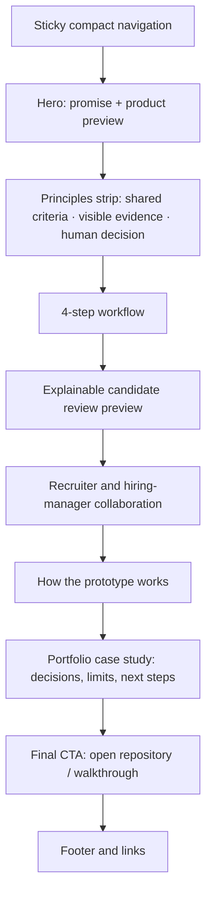

# KarsaHire Landing Page Plan

**Status:** first implementation available at /; recruitment workspace remains at /app.

## 1. Goal and audience

Present KarsaHire as a clear portfolio case study for collaborative hiring: recruiter and hiring manager agree on criteria, the system extracts evidence from CVs, and people make the final decision. The page should explain the product in under a minute and give a technical reviewer a path to the workflow, architecture, and source code.

Primary audiences:

- Recruiters and hiring managers who need a shared review workflow.
- Portfolio reviewers looking for product thinking, explainable matching, and a working prototype.
- Engineers reviewing the parsing, ranking, storage, and audit design.

Positioning line: **“Hiring decisions, built on shared criteria and visible evidence.”**

Recommended hero copy:

> **Review candidates together. See the evidence behind every match.**
>
> KarsaHire helps hiring teams agree on role criteria, organize CV evidence, and make human-led shortlist decisions.

Keep Indonesian as the first language for the product audience. Add an English switch only if the case study is being shown to international portfolio reviewers; do not mix languages in the same sentence.

## 2. Page layout

Use a responsive, single-page product story with a maximum content width around 1,200 px. Reuse the existing app palette and card language: warm off-white `#f4f5f1`, ink `#1e2b27`, forest green `#335a48`, pale green `#e9f1eb`, and mint `#bfe0ca`. Keep typography close to the prototype's system sans-serif so the landing page feels related to the app.



| Section | Desktop layout | Content and purpose |
|---|---|---|
| Navigation | Brand left; section links and one CTA right | KarsaHire mark; `Cara kerja`, `Explainability`, `Teknologi`; `Lihat repository`. On mobile collapse links into a menu. |
| Hero | 5/7 split: copy left, product preview right | State the shared-criteria and evidence promise. CTA: `Lihat alur kerja`; secondary: `Buka GitHub`. Show a real prototype screen populated only with synthetic data. |
| Principles strip | Three short items across | Criteria approved before ranking; match explanations have CV evidence; decisions remain with reviewers. Avoid invented customer logos or performance claims. |
| Workflow | Four numbered cards in a row; vertical stack on mobile | 1) Agree on role criteria, 2) parse CVs, 3) inspect matches and evidence, 4) review and record a human decision. |
| Evidence preview | Large UI mockup with callouts | Show a criterion, a short synthetic evidence snippet, match status, confidence, and an `unknown / needs verification` state. Explain that a missing CV statement is not an automatic rejection. |
| Collaboration | Two reviewer panels joined by a criteria approval step | Recruiter manages the process; hiring manager confirms role criteria; both approve before CV ranking. Make the collaboration visible without implying that current demo has authenticated accounts. |
| System overview | Simple horizontal pipeline | Intake → PDF/DOCX/TXT parsing and optional OCR → evidence profile → lexical match → retrieval over requisition → human review and audit. Label this as the current prototype path. |
| Portfolio case study | Two columns: design decisions and current limits | Explain SQLite storage, local-first prototype, evidence-backed baseline scoring, synthetic test corpus, and next work such as semantic retrieval, stronger identity/access controls, and fairness evaluation. Distinguish shipped behavior from roadmap. |
| Final CTA | Dark green band | `Explore the KarsaHire prototype` with links to the GitHub repository and architecture plan. Do not link a public visitor to `localhost`. |
| Footer | Minimal | Product name, GitHub, architecture plan, synthetic-data attribution, and prototype disclaimer. |

### Hero product preview

Build this from HTML/CSS or capture it from the actual app rather than using a generic AI stock image. The first screen should show:

- A sample requisition and two-role approval status.
- Three synthetic candidate rows with criterion-level evidence.
- A visible confidence or `perlu verifikasi` state.
- A small label: `Prototype · synthetic CV data`.

Do not display candidate email, phone, or other direct identifiers. If an existing app screenshot is used, seed it with synthetic test data and crop away browser chrome and any local environment information.

## 3. Asset shortlist

| Asset | Recommendation | Source and usage notes |
|---|---|---|
| Shortlist dashboard illustration | Product visual in the hero, using synthetic interface content and the KarsaHire palette. | web/assets/karsahire-shortlist-dashboard.png; generated for this project. |
| Workflow animation | Supporting loop for criteria → CV evidence → team review. A static flow appears when reduced motion is enabled. | web/assets/karsahire-workflow-loop.gif; generated for this project. |
| Logo concept | A horizontal K mark and KarsaHire wordmark exploring a shared-evidence symbol. Treat this as a concept; recreate/finalize as SVG before shipping so it stays crisp at all sizes. | Local preview: `web/assets/karsahire-logo-concept.png`. Generated for this project; transparent PNG. |
| Product visual | Prefer a custom screenshot or recreated product mockup from the current KarsaHire UI. It proves what this project actually does and avoids generic AI imagery. | Use synthetic data only. Crop to the app surface and provide a textual caption below the image. |
| Collaboration illustration | Generated a transparent PNG of two reviewers discussing an evidence card. Use it in the collaboration section, paired with text rather than as a background. | Local asset: `web/assets/karsahire-team-review.png`. Generated for this project; no external image source. |
| Supporting illustration | Use at most one small SVG for the workflow or collaboration section; shortlist **Project Flow** for the pipeline or **Team Permissions** for the two-reviewer approval step. Recolor it to the forest-green palette. Avoid a large illustration competing with the product preview. | [unDraw illustrations](https://undraw.co/illustrations) currently lists both concepts and supports recoloring/downloading artwork. Its open license permits commercial and personal use without attribution. Save the chosen SVG locally and record its source URL. [License/source](https://handcrafts.undraw.co/). |
| Icons | Use a consistent 18–22 px line-icon set: users, file-search, list-checks, shield-check, eye, and arrow-right. | [Lucide](https://lucide.dev/icons/) is the best fit for the existing HTML/CSS/JS prototype; its project README states it is ISC-licensed. Keep its license notice when copying icon files into the project. [License](https://github.com/lucide-icons/lucide/blob/main/LICENSE). |
| Optional human photo | Only use a single photo in a lower-page collaboration section if the product UI needs a human context. Prefer a real workshop/team conversation over a posed handshake or generic robot image. The hero should remain product-led. | Browse [Unsplash team-collaboration results](https://unsplash.com/s/photos/team-collaboration) and check each selected photo's source/subject before use. Unsplash's license permits free commercial and non-commercial use, with attribution appreciated; it also lists prohibited uses. [License](https://unsplash.com/license). Record the photographer and source URL in an asset note even when attribution is not required. |
| Brand mark | Keep the existing K monogram and wordmark. Create a simple SVG only if a standalone favicon or social preview is needed. | Use the existing product mark and colors for continuity. |
| Font | Keep the current system sans stack for the first pass. If a branded font is needed, evaluate DM Sans and self-host it after checking the font license and weights needed. | [DM Sans source](https://github.com/google/fonts/tree/main/ofl/dmsans). Avoid loading many font weights; use regular and semibold only. |

### Asset directory proposal

```text
web/assets/
  karsahire-logo-concept.png     # generated transparent logo exploration
  karsahire-mark.svg             # final vector logo, after selection
  landing-product-preview.webp
  karsahire-team-review.png      # generated transparent collaboration illustration
  workflow-project-flow.svg      # optional unDraw illustration; source recorded
  icons/                         # only if icons are copied as static SVGs
  ATTRIBUTION.md                 # source URL, author, license for each external asset
```

Export product screenshots as WebP, with a PNG fallback only if transparency is needed. Keep the screenshot crisp at 2× display size and lazy-load images below the fold. Avoid remote hotlinked images so the page remains stable and avoids unexpected third-party requests.

## 4. Motion plan

Use restrained motion to clarify the workflow, not to decorate every section. The existing project is plain HTML/CSS/JavaScript, so start with CSS transitions and a small `IntersectionObserver` reveal. Do not add an animation dependency for this page.

| Element | Motion | Timing |
|---|---|---|
| Hero headline and actions | Fade in with a 8–12 px upward settle | 220–300 ms, on first render |
| Product preview | Fade in, then reveal its 3 candidate rows with a short stagger | 280 ms total; play once, no loop |
| Workflow steps | Subtle opacity and 10 px rise when entering view | 240 ms per group; no parallax |
| Evidence rows | A single low-amplitude highlight sweep from criterion to snippet | 300–400 ms, once on scroll or user focus |
| Buttons and cards | Color/shadow transition; 1–2 px hover lift | 140–180 ms; keep keyboard focus equally visible |
| Mobile menu | Short opacity/height transition | 160–200 ms; preserve focus and Escape-to-close behavior |

Avoid autoplay video, continuous floating cards, scroll-jacking, cursor-following effects, large scaling, and motion that is required to understand the score. Respect the operating-system reduced-motion preference with `@media (prefers-reduced-motion: reduce)` by removing non-essential transforms, stagger, and smooth scrolling. MDN documents this preference query and recommends reducing or replacing motion when a visitor requests it: [MDN reduced-motion guidance](https://developer.mozilla.org/en-US/docs/Web/CSS/Reference/At-rules/%40media/prefers-reduced-motion).

## 5. Responsive and accessibility rules

- Desktop (≥ 1,024 px): two-column hero, four workflow cards in one row, full product preview.
- Tablet (720–1,023 px): keep the hero split only if both columns retain at least 320 px; otherwise stack it. Use two workflow cards per row.
- Mobile (< 720 px): single column, no horizontal page scrolling, stack CTA buttons, crop product preview inside a labelled scrollable frame only when necessary.
- Keep body text at 16 px or larger for key copy, meet WCAG AA contrast, and do not encode match status with color alone.
- Give screenshots and SVGs useful alternative text; mark decorative shapes as hidden from assistive technology.
- Provide visible keyboard focus, descriptive link labels, semantic headings, and reduced-motion behavior.

## 6. Copy and accuracy guardrails

- Describe current matching as an explainable lexical baseline, not an AI prediction or a measure of a person's quality.
- Say the current Q&A searches the saved requisition content; do not claim production generative RAG is live.
- Call OCR optional and configuration-dependent. Do not say it is enabled on the current local instance.
- Say the 32-CV test set is synthetic and for development; do not imply real hiring outcomes or customer usage.
- Present future embedding search, production authentication, fairness evaluation, and integrations as roadmap items.
- Avoid terms such as `culture fit`, personality inference, automatic rejection, or guaranteed bias-free results.

## 7. Build sequence and completion criteria

1. Write and review Indonesian page copy against the current prototype; label current features versus roadmap.
2. Create a synthetic-data product screenshot and confirm that it contains no personal identifiers or local service details.
3. Build semantic HTML sections and responsive layout using the existing palette and type stack.
4. Add local SVG icons/optional illustration and document all asset sources in `ATTRIBUTION.md`.
5. Add the small motion set, keyboard behavior, and reduced-motion handling.
6. Review at desktop, tablet, and mobile widths; verify contrast, focus, image text alternatives, CTA destinations, and no horizontal overflow.

The landing page is ready when a new visitor can explain the product's collaborative workflow, see a real evidence-based UI example, understand which capabilities are in the prototype versus planned, and open the repository without encountering broken links or real candidate data.
